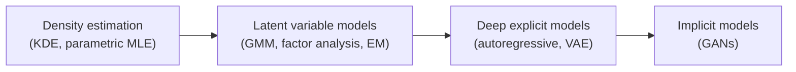

## Motivation

Generative modeling is the art of **learning to sample**.
Given a dataset (images, text, audio), we want a model that produces new samples that look like they came from the same data-generating process, without copying the training set.
Historically, the field evolved as a sequence of increasingly flexible *assumptions* about how data is generated, and increasingly scalable *training objectives* for fitting those assumptions.

Below is a high-level timeline of the families we will cover.

    

        
    

    Timeline of generative models

<aside>

Throughout, I use \(P\) for a probability distribution.
If \(P\) is continuous (with respect to Lebesgue measure), I write a probability density function (PDF) \(p\).
If \(P\) is discrete, I write a probability mass function (PMF) \(p\), where \(p(x)=\mathbb{P}(X=x)\).
The symbol is the same, but the meaning is not — and mixing them casually is a common source of mistakes.

</aside>

---

## 1. The Probabilistic Starting Point

### 1.1 Distributions, densities, and mass functions

We model a datapoint as a random variable \(X\) taking values in a space \(\mathcal{X}\).
For an image, a convenient abstraction is \(\mathcal{X}=[0,1]^{H\times W\times C}\) (continuous intensities), or a discrete grid like \(\{0,\ldots,255\}^{H\times W\times C}\) (integer intensities).
A dataset is then modeled as independent and identically distributed (i.i.d.) samples:

$$
\mathcal{D}=\{x_1,\ldots,x_n\},\qquad x_i \stackrel{\text{i.i.d.}}{\sim} P_{\text{data}}.
$$

This equation says there exists an unknown distribution \(P_{\text{data}}\) that generated our dataset, and each observed \(x_i\) is a realization of the random variable \(X\sim P_{\text{data}}\).
The i.i.d. assumption is not claiming that pixels inside an image are independent; it is only a modeling convenience that treats *examples* as independent draws.
It is what makes “replace an expectation by an average over the dataset” mathematically legitimate, which is exactly what mini-batch training does.
It also clarifies what we are trying to learn: not a single image, but the full distribution over possible images in \(\mathcal{X}\).
When the assumption is violated (time series, sequential dependence), we switch to conditional or autoregressive formulations later, but the distributional mindset remains the same.

A probability distribution assigns probabilities to **events** (sets) \(A\subseteq \mathcal{X}\).
When \(X\) is continuous and has a PDF \(p_{\text{data}}(x)\), probabilities are obtained by integration:

$$
P_{\text{data}}(A)=\mathbb{P}(X\in A)=\int_A p_{\text{data}}(x)\,dx.
$$

This is the precise reason a “density” is not itself a probability: only the integral over a region is a probability.
In continuous spaces, the PDF \(p_{\text{data}}(x)\) can even exceed \(1\) at some points; what must equal \(1\) is the integral over all of \(\mathcal{X}\).
Equally important, a density has **units**: if \(x\in\mathbb{R}^d\), then \(p(x)\) has units of “per \((\text{unit})^d\),” which is why you can’t interpret \(p(x)\) as a probability of an exact point.
For discrete variables, the analogous statement replaces the integral with a sum and uses a PMF, where the probability of an exact outcome is meaningful.
In one dimension, the cumulative distribution function \(F(x)=\mathbb{P}(X\le x)\) is another way to encode the same information as a PDF, but in deep generative modeling we almost always work with PDFs/PMFs (or samples) because CDFs do not scale cleanly to high-dimensional data.
Keeping these distinctions clean is not pedantry; it is what keeps later derivations about likelihoods and divergences mathematically correct.

### 1.2 Why high dimensional data changes the game

A single RGB image can be viewed as a vector in \(\mathbb{R}^d\) with \(d=H\cdot W\cdot C\).
For \(400\times 400\) images with \(C=3\), this is \(d=480{,}000\) dimensions.
In such spaces, two practical facts become unavoidable.

First, *writing down* a distribution explicitly is hard: even if a true density exists, we almost never know it in closed form.
Second, *integrating* over \(\mathcal{X}\) is impossible, so we rely on Monte Carlo estimates: expectations under \(P_{\text{data}}\) are approximated by sample averages over \(\mathcal{D}\).
These constraints explain why generative modeling split into different families.
Some families insist on a tractable likelihood (explicit density models) and accept architectural constraints.
Other families insist on flexible sampling and accept that the density is implicit or intractable.
Understanding this tradeoff early makes the later progression — from MLE to EM to VAEs to GANs — feel less like a collection of tricks and more like a sequence of compromises rooted in probability theory.

---

## 2. Density Estimation and Likelihood Thinking

### 2.1 Maximum likelihood estimation

The earliest “modern” story of generative modeling is **density estimation**: pick a family of distributions \(p_\theta(x)\) and fit parameters \(\theta\) so that the observed data becomes likely under that family.
The maximum likelihood estimator (MLE) is:

$$
\hat{\theta}_{\text{MLE}}
=\arg\max_{\theta}\prod_{i=1}^n p_\theta(x_i)
=\arg\max_{\theta}\sum_{i=1}^n \log p_\theta(x_i).
$$

The object \(p_\theta(x)\) is a PDF when \(x\) is continuous and a PMF when \(x\) is discrete; either way, it is the model’s probability law indexed by \(\theta\).
The product form comes from the i.i.d. assumption: it treats the joint likelihood of the dataset as a product of per-example likelihoods.
Taking logs turns the product into a sum, which is numerically stable and matches how we implement losses in deep learning.
What assumptions are “baked in” here?
We assume the data distribution can be captured by our chosen family \(\{p_\theta\}\), and we assume that maximizing likelihood is a good surrogate for “matching distributions.”
When the family is too simple (say a single Gaussian for a multi-modal dataset), MLE does exactly what it is supposed to do — it finds the best Gaussian — but the model is still wrong.
This is where the field historically moved next: either choose a richer statistical family (mixtures, latent variables), or choose a richer function class (neural networks), or both.

### 2.2 Nonparametric density estimation in one line

A classical alternative to choosing a parametric family is to assume only that the density is “smooth,” and estimate it directly from samples.
A standard kernel density estimator (KDE) is:

$$
\hat{p}_h(x)=\frac{1}{n\,h^d}\sum_{i=1}^n K\!\left(\frac{x-x_i}{h}\right),
$$

where \(K\) is a kernel function (often a Gaussian), \(h>0\) is a bandwidth, and \(d\) is the dimension of \(x\).
You can read this as “place a small bump \(K(\cdot)\) around each datapoint and add them up,” with \(h\) controlling how wide each bump is.
KDE makes a very different assumption than parametric MLE: it assumes local smoothness rather than a specific global shape like “Gaussian.”
When \(d\) is small, KDE is intuitive and powerful; when \(d\) is huge (images), the factor \(h^d\) makes the estimator extremely sensitive, and you need an astronomical number of samples to fill the space.
This is one concrete manifestation of the curse of dimensionality, and it helps explain why modern generative modeling leaned heavily on representation learning.
Deep generative models can be seen as learning a lower-dimensional, structured representation in which “density estimation” becomes feasible again.
So KDE is not just a historical curiosity; it’s a clean baseline that highlights what breaks in high dimensions and what deep models try to fix.

### 2.3 Worked micro-example- 1D Gaussian MLE

Assume data \(x_1,\ldots,x_n\in\mathbb{R}\) are generated from a normal distribution with mean \(\mu\) and variance \(\sigma^2>0\).
The Gaussian PDF is:

$$
p(x\mid \mu,\sigma^2)=\frac{1}{\sqrt{2\pi\sigma^2}}\exp\!\left(-\frac{(x-\mu)^2}{2\sigma^2}\right).
$$

This formula encodes a very strong modeling assumption: the distribution is symmetric, unimodal, and fully described by only two parameters.
The normalization term \(\frac{1}{\sqrt{2\pi\sigma^2}}\) ensures the integral over all real numbers equals \(1\), which is why it depends on \(\sigma^2\).
The exponential term assigns higher density to values near \(\mu\), with spread controlled by \(\sigma^2\); larger \(\sigma^2\) makes the density flatter and smaller \(\sigma^2\) makes it peak more sharply.
In generative modeling language, this is a tiny “generator”: sample \(\epsilon\sim\mathcal{N}(0,1)\) and output \(x=\mu+\sigma \epsilon\).
This example is useful because we can compute MLE in closed form, which makes the role of assumptions and objectives painfully clear.
As soon as the data distribution is not close to Gaussian, the same MLE machinery still works, but it optimizes the wrong hypothesis class.

The (log-)likelihood for a dataset under this model is:

$$
\ell(\mu,\sigma^2)
=\sum_{i=1}^n \log p(x_i\mid\mu,\sigma^2)
=-\frac{n}{2}\log(2\pi\sigma^2)-\frac{1}{2\sigma^2}\sum_{i=1}^n (x_i-\mu)^2.
$$

This expression shows why MLE often feels like “least squares wearing a probability hat.”
The second term is a scaled sum of squared errors, so maximizing \(\ell\) is equivalent to minimizing squared deviations from \(\mu\), with \(\sigma^2\) controlling how heavily deviations are penalized.
The first term prevents \(\sigma^2\) from collapsing to zero, because shrinking \(\sigma^2\) increases the penalty \(-\frac{n}{2}\log\sigma^2\).
Crucially, \(\ell\) is a function of the parameters given fixed data: it is not “the probability of the parameters,” but a score that ranks parameter choices by how well they explain the observations.
This distinction between probability and likelihood matters later, because deep generative models often train by maximizing a likelihood (or a bound on it) even when the model’s density is not directly visible.

Setting derivatives to zero gives the MLE:

$$
\hat{\mu}=\frac{1}{n}\sum_{i=1}^n x_i,
\qquad
\hat{\sigma}^2=\frac{1}{n}\sum_{i=1}^n (x_i-\hat{\mu})^2.
$$

The estimator \(\hat{\mu}\) is simply the sample mean: under the Gaussian assumption, it is the parameter that makes the observed samples most likely.
The variance estimate \(\hat{\sigma}^2\) is the average squared deviation from \(\hat{\mu}\); note the denominator is \(n\) (not \(n-1\)) because this is the MLE, not the unbiased estimator used in classical statistics.
This micro-example illustrates an important theme in the timeline: early generative modeling often offered *exact* likelihoods and *exact* optimization.
As models became more expressive (mixtures, neural decoders, implicit generators), exact likelihoods and exact solutions became rare, and we replaced them with iterative procedures (EM), bounds (ELBO), or games (GANs).
But the guiding principle stayed the same: pick a probabilistic objective, then design an estimator you can compute at scale.

### 2.4 A Bayesian alternative in one equation

MLE treats \(\theta\) as an unknown constant to be estimated.
Bayesian modeling instead treats \(\theta\) as a random variable with a prior \(p(\theta)\) and updates it using Bayes’ rule:

$$
p(\theta\mid \mathcal{D})\propto p(\mathcal{D}\mid \theta)\,p(\theta).
$$

This equation shifts the assumption from “there is one best parameter” to “there is uncertainty over parameters.”
The likelihood term \(p(\mathcal{D}\mid \theta)\) is exactly the same object used by MLE; what changes is that we now combine it with a prior belief \(p(\theta)\) that encodes inductive bias or domain knowledge.
In conjugate cases (like a Gaussian mean with a Gaussian prior), this update can be done analytically and yields a posterior that is easy to sample from, giving uncertainty-aware predictions.
In large modern models, the posterior is rarely tractable, so we approximate it (variational inference) or sample it (MCMC), which connects directly to the motivations behind VAEs.
Bayesian thinking also clarifies *why* regularization works: many regularizers are equivalent to log-priors, so “MAP estimation” is MLE plus a prior-induced penalty.
Even if you never run full Bayesian inference, keeping this lens helps you interpret objectives and understand what kind of uncertainty your generative model can or cannot represent.

---

## 3. Latent Variable Models and EM Intuition

### 3.1 Mixture models as "hidden causes"

A single Gaussian cannot represent multi-modal data, so a natural step is to introduce a discrete latent variable \(Z\in\{1,\ldots,K\}\) that selects one of \(K\) components.
A mixture model writes the marginal density as:

$$
p(x)=\sum_{k=1}^{K}\pi_k\,p(x\mid Z=k),
\qquad
\pi_k\ge 0,\ \sum_{k=1}^K \pi_k=1.
$$

Here \(Z\) is unobserved (“latent”), and \(\pi_k\) are mixing weights: \(\pi_k\) is the probability mass that the model assigns to component \(k\).
If \(p(x\mid Z=k)\) is Gaussian, we obtain a Gaussian mixture model (GMM), which can represent multiple clusters and asymmetric shapes even in one dimension.
The key assumption is that complexity comes from *heterogeneity*: each datapoint is generated by first choosing a hidden cause \(Z\), then sampling \(x\) from the corresponding component distribution.
This is the same generative pattern that later appears in VAEs and many deep generative models: sample a latent variable, then decode it into an observation.
What improves compared to a single Gaussian is expressiveness; what breaks is optimization, because the latent assignments are unknown and must be inferred.

The dataset log-likelihood under a mixture model is:

$$
\log p(\mathcal{D})
=\sum_{i=1}^n \log\left(\sum_{k=1}^{K}\pi_k\,p(x_i\mid Z=k)\right).
$$

The inner sum aggregates all the ways the model could have generated \(x_i\): via component 1, component 2, and so on.
The outer log is what makes maximum likelihood difficult: \(\log\sum_k (\cdot)\) couples all components together, so we cannot optimize each component independently.
This is a prototypical example of “latent-variable pain” in probabilistic modeling: the model is expressive and conceptually clean, but the inference problem becomes nontrivial.
The rest of the story in generative modeling can be read as repeated attempts to keep the expressiveness of latent variables while making inference and learning scalable.
EM is the classical solution; variational inference and amortized inference (VAEs) are the deep learning solution; adversarial training (GANs) largely avoids explicit inference by changing the objective.

### 3.2 Factor analysis intuition

Mixture models use a discrete latent variable to explain “which cluster generated this point.”
Factor analysis uses a continuous latent variable to explain “which low-dimensional factors generated this point.”
A standard factor analysis model is:

$$
x=\mu+\Lambda z+\varepsilon,
\qquad
z\sim \mathcal{N}(0,I),
\qquad
\varepsilon\sim \mathcal{N}(0,\Psi),
$$

where \(x\in\mathbb{R}^d\) is observed, \(z\in\mathbb{R}^k\) with \(k\ll d\) is latent, \(\Lambda\in\mathbb{R}^{d\times k}\) is a loading matrix, and \(\Psi\) is (typically diagonal) noise covariance.
This equation says: start with a low-dimensional latent “factor” vector \(z\), linearly map it into data space with \(\Lambda\), add a mean \(\mu\), and then add noise \(\varepsilon\).
The modeling assumption is that high-dimensional observations live near a low-dimensional linear subspace plus independent noise, which is why factor analysis is closely related to PCA but framed probabilistically.
In the generative modeling timeline, factor analysis is an important conceptual precursor to VAEs: replace the linear map \(\Lambda z\) with a deep neural network decoder \(f_\theta(z)\), and replace the analytic posterior with an approximate, learned encoder.
So even though modern deep models are nonlinear, it is useful to remember that “latent-variable generation” started with simple linear-Gaussian stories that were easy to interpret and analyze.
The motivation did not change: represent complex, high-dimensional data through simpler latent causes; only the function class did.

### 3.3 EM as alternating “guess and optimize”

The expectation–maximization (EM) algorithm optimizes mixture models by iterating between estimating latent assignments and updating parameters.
The key quantity is the **responsibility**:

$$
r_{ik}
=\mathbb{P}(Z=k\mid x_i)
=\frac{\pi_k\,p(x_i\mid Z=k)}{\sum_{j=1}^{K}\pi_j\,p(x_i\mid Z=j)}.
$$

The responsibility \(r_{ik}\) is the posterior probability (a PMF over \(k\)) that component \(k\) generated point \(x_i\).
It turns “hard clustering” into a soft assignment: a datapoint can partially belong to multiple components, and the weights depend on both the prior mixing weights \(\pi_k\) and the component likelihoods \(p(x_i\mid Z=k)\).
In EM, the E-step computes these responsibilities using the current parameters, and the M-step updates parameters by maximizing the expected complete-data log-likelihood under the current responsibilities.
What assumptions are being made?
We assume that computing \(r_{ik}\) is tractable (true for GMMs) and that alternating updates will converge to at least a local optimum.
The deeper intuition is that EM replaces the difficult \(\log\sum\) structure with an easier surrogate objective that becomes tight when the responsibilities match the true posterior.
This idea — introducing an auxiliary distribution over latents to lower-bound a log-likelihood — is exactly what the ELBO in VAEs does, just with neural networks and continuous latent variables.

---

## 4. Deep Generative Models Before GANs

    

        
    

    Evolution of generative models

### 4.1 Autoregressive modeling

When the data has a natural ordering (tokens in text, time steps in audio, or pixels in a raster scan), a direct way to define a joint distribution is to factor it into conditional distributions:

$$
p_\theta(x_{1:T})=\prod_{t=1}^{T} p_\theta(x_t\mid x_{1:t-1}).
$$

This equation is always true as a statement of probability (the chain rule), but it becomes a model when we choose a parameterization for the conditionals \(p_\theta(x_t\mid x_{<t})\).
Autoregressive models make a clear assumption: the future depends on the past through a learnable conditional distribution, and we can compute (and maximize) the exact log-likelihood by summing the log of each conditional.
This is attractive for evaluation because the likelihood is explicit and comparable across models.
The tradeoff is sampling: to generate one sample \(x_{1:T}\), we must sample sequentially from \(t=1\) to \(T\), which can be slow for large \(T\) (long text, high-resolution images).
In practice, architectures like masked convolutions (PixelCNN) or causal self-attention implement these conditionals at scale.
Conceptually, autoregressive modeling is “density estimation without latent variables”: all uncertainty is represented directly in the sequence of outputs.

### 4.2 Variational autoencoders

VAEs return to the latent-variable idea but make the decoder a neural network and the latent variable continuous.
A standard VAE generative model is:

$$
p_\theta(x)=\int p_\theta(x\mid z)\,p(z)\,dz,
\qquad
p(z)=\mathcal{N}(0,I).
$$

Here \(z\) is a continuous latent variable (often low-dimensional), \(p(z)\) is a simple prior (a standard normal), and \(p_\theta(x\mid z)\) is a decoder network that maps latents to a distribution over observations.
The integral marginalizes out the latent variable: it says the model density at \(x\) is the average of decoder likelihoods over all possible latents, weighted by the prior.
This is expressive because the decoder can be highly nonlinear, but it breaks tractability: the integral is usually intractable in high dimensions, so exact maximum likelihood is hard.
VAEs fix this by introducing an approximate posterior \(q_\phi(z\mid x)\) (an encoder network) and optimizing a lower bound on \(\log p_\theta(x)\), not \(\log p_\theta(x)\) itself.
This is the bridge between classical latent variable models and modern deep learning: the inference procedure is learned (“amortized”) across the dataset rather than solved from scratch for each datapoint.

The evidence lower bound (ELBO) is:

$$
\log p_\theta(x)
\ge
\mathbb{E}_{z\sim q_\phi(z\mid x)}\left[\log p_\theta(x\mid z)\right]
-\mathrm{KL}\!\left(q_\phi(z\mid x)\,\|\,p(z)\right).
$$

This bound has two interpretable terms.
The first term is a reconstruction-like objective: under latents sampled from the encoder, the decoder should assign high probability (high log-likelihood) to the observed \(x\).
The second term is a regularizer: it penalizes the encoder distribution \(q_\phi(z\mid x)\) for drifting too far from the prior \(p(z)\), where \(\mathrm{KL}(\cdot\|\cdot)\) denotes the Kullback–Leibler divergence.
The direction of the KL is important: \(\mathrm{KL}(q_\phi(z\mid x)\|p(z))\) encourages each posterior to look like the prior, which makes sampling from the prior at test time meaningful.
Optimizing the ELBO trades exact likelihood for a tractable objective that can be estimated with Monte Carlo samples of \(z\), and trained end-to-end with backpropagation (via the reparameterization trick).
In the timeline, VAEs are a key milestone: they made latent-variable generative modeling scalable with deep networks, but they still require a likelihood model \(p_\theta(x\mid z)\) and often struggle with sharp sample quality under simple output distributions.

---

## 5. GANs as Distribution Matching

### 5.1 The minimax game

GANs take a different route: instead of writing down a tractable likelihood, they define a **sampler** \(x=G_\theta(z)\) and learn it through an adversarial game.
The original GAN objective is:

$$
\min_{\theta}\max_{\psi}\;
\mathbb{E}_{x\sim P_{\text{data}}}\left[\log D_\psi(x)\right]
+
\mathbb{E}_{z\sim P_Z}\left[\log\!\left(1-D_\psi(G_\theta(z))\right)\right].
$$

Here \(G_\theta\) is the generator, \(D_\psi:\mathcal{X}\to(0,1)\) is the discriminator, and \(P_Z\) is a simple noise distribution such as \(\mathcal{N}(0,I)\).
The discriminator is trained to output large values on real data (\(D_\psi(x)\approx 1\)) and small values on fake samples (\(D_\psi(G_\theta(z))\approx 0\)).
The generator is trained to make the discriminator fail by producing samples that push \(D_\psi(G_\theta(z))\) upward.
This objective does not require evaluating a model density \(p_\theta(x)\); it only requires sampling \(z\) and running \(G_\theta\) forward.
That is why GANs are called **implicit** models: they define a distribution via a sampling procedure, not via an explicit PDF/PMF.
The cost is optimization complexity: we are no longer minimizing a single function, but solving a game, which can be unstable and sensitive to hyperparameters.

### 5.2 The discriminator as a density-ratio estimator

Under idealized conditions (infinite capacity and optimal optimization of \(D_\psi\) for fixed \(G_\theta\)), the optimal discriminator has a closed form:

$$
D^*(x)=\frac{p_{\text{data}}(x)}{p_{\text{data}}(x)+p_\theta(x)}.
$$

This equation is the mathematical reason GANs are about distribution matching.
It says the best discriminator at each point \(x\) is a posterior probability: “how likely is \(x\) to be real rather than generated?”
If \(p_\theta(x)\) matches \(p_{\text{data}}(x)\), then \(D^*(x)=\tfrac{1}{2}\) everywhere, meaning the discriminator cannot do better than random guessing.
If the generator misses some regions where \(p_{\text{data}}(x)\) is large, then \(D^*(x)\) approaches \(1\) on those regions, because real data dominates there.
This also exposes a subtle point: even though GANs do not explicitly compute \(p_\theta(x)\), the theory that explains them assumes such a density exists (at least conceptually) to define what “matching” means.
In practice, we operate with samples and gradients, but keeping the density-level interpretation helps you reason about failures like mode collapse and vanishing gradients.
In particular, it highlights that what matters is not “pixel-wise similarity,” but matching the full high-dimensional distribution over structured objects.

A useful rewrite is in terms of the discriminator logit:

$$
\log\frac{D^*(x)}{1-D^*(x)}=\log\frac{p_{\text{data}}(x)}{p_\theta(x)}.
$$

The left-hand side is the log-odds that a point is real, and the right-hand side is the **log density ratio** between data and model.
So, in the idealized setting, training a discriminator is equivalent to learning a density-ratio estimator.
This view explains many practical heuristics: if the discriminator becomes too accurate, it may imply the ratio is extreme in most regions, and the generator may receive weak gradients because the game is saturated.
It also clarifies why alternative losses (like the “non-saturating” generator loss) are used in practice: they change the gradient landscape without changing the fixed point under an optimal discriminator.
More broadly, the density-ratio perspective connects GANs to a larger literature on divergence minimization and statistical two-sample testing, where a classifier is trained to distinguish samples from two distributions.

### 5.3 What broke and what improved

From a timeline perspective, GANs made a bold trade:
they gave up explicit likelihoods to gain sharp, high-fidelity samples.
What broke is that evaluation and training became harder.

Because GANs lack a tractable \(p_\theta(x)\), log-likelihood cannot be used directly for evaluation, and we rely on sample-based metrics (or downstream utility).
Because training is a minimax game, optimization can cycle, diverge, or collapse to a few modes, especially when the discriminator and generator are imbalanced.
Over the years, the community introduced stabilizers: alternative divergences (e.g., f-GAN), different critics and constraints (e.g., Wasserstein-inspired critics), and regularization tricks like gradient penalties and spectral normalization.
But the core conceptual contribution remains: you can learn a powerful sampler by matching distributions through a learned critic, even when the density is implicit.

---

## 6. Common Confusions

**PDF vs PMF vs CDF.**  
A PDF \(p(x)\) is used for continuous variables and must be integrated over a region to obtain a probability.
A PMF \(p(x)=\mathbb{P}(X=x)\) is used for discrete variables and can be summed to obtain a probability.
A CDF \(F(x)=\mathbb{P}(X\le x)\) is a function of a scalar variable that encodes all probabilities up to a threshold; it is essential in 1D probability, but most deep generative modeling objectives are written in terms of PDFs/PMFs (or samples), not CDFs, especially in high-dimensional spaces.

**Likelihood vs probability.**  
The likelihood \(p_\theta(x)\) is a function of parameters \(\theta\) given fixed data \(x\), while probability is a function of outcomes given fixed parameters.
Saying “the likelihood of \(\theta\)” is shorthand; the precise statement is “the likelihood function evaluated at \(\theta\).”
This distinction helps you interpret objectives: MLE maximizes a likelihood function; VAEs maximize a lower bound on log-likelihood; GANs avoid likelihood evaluation but can still be analyzed in terms of densities.

**The direction of KL matters.**  
\(\mathrm{KL}(P\|Q)\) and \(\mathrm{KL}(Q\|P)\) are generally different.
Intuitively, \(\mathrm{KL}(P_{\text{data}}\|P_\theta)\) heavily penalizes missing regions where data has support (mode covering), while \(\mathrm{KL}(P_\theta\|P_{\text{data}})\) can ignore some modes if the model concentrates on a subset (mode seeking).
This is one reason different generative families exhibit different failure modes even when they all claim to “match the data distribution.”

**Why GAN loss can saturate.**  
If the discriminator quickly becomes perfect, then \(D_\psi(G_\theta(z))\) is near \(0\) and \(\log(1-D_\psi(G_\theta(z)))\) provides weak gradients for the generator.
The common “non-saturating” generator objective replaces the generator’s minimization term with \(-\mathbb{E}_{z}[\log D_\psi(G_\theta(z))]\), which yields stronger gradients early in training while preserving the same optimal solution under idealized assumptions (Goodfellow et al., 2014).
This is a good example of a practical modification that changes optimization behavior without changing the underlying distribution-matching goal.

---

## 7. Summary

- Generative modeling starts with a probabilistic view: data are samples \(x_i\sim P_{\text{data}}\) from an unknown distribution over a high-dimensional space.
- Early approaches fit simple families by maximum likelihood, making strong parametric assumptions but enabling exact objectives and clean math.
- Nonparametric density estimation (KDE) shows why high dimensionality is hard: smoothness alone is not enough without massive data.
- A worked 1D Gaussian example shows how MLE becomes a closed-form solution under a specific modeling choice.
- Latent variable models (mixtures, factor analysis) explain complex data via hidden causes \(Z\) or low-dimensional factors \(z\), but introduce inference challenges.
- EM alternates between estimating latent assignments (responsibilities) and updating parameters, foreshadowing variational objectives used in deep models.
- Autoregressive models use the chain rule factorization to obtain exact likelihoods, at the cost of sequential sampling.
- VAEs combine neural decoders with latent variables and train via the ELBO, trading exact likelihood for a tractable bound and amortized inference.
- GANs learn an implicit sampler via a minimax game, trading away explicit likelihood evaluation for sharp samples and distribution matching via a critic.
- In the idealized setting, the discriminator’s logit estimates the log density ratio \(\log(p_{\text{data}}/p_\theta)\), making the “adversarial” structure mathematically meaningful.

---

## References

- Fisher, R. A. (1922). *On the Mathematical Foundations of Theoretical Statistics*. Philosophical Transactions of the Royal Society A.
- Parzen, E. (1962). *On Estimation of a Probability Density Function and Mode*. The Annals of Mathematical Statistics.
- Dempster, A. P., Laird, N. M., & Rubin, D. B. (1977). *Maximum Likelihood from Incomplete Data via the EM Algorithm*. Journal of the Royal Statistical Society: Series B.
- Bishop, C. M. (2006). *Pattern Recognition and Machine Learning*. Springer.
- Murphy, K. P. (2012). *Machine Learning: A Probabilistic Perspective*. MIT Press.
- van den Oord, A., Kalchbrenner, N., & Kavukcuoglu, K. (2016). *Pixel Recurrent Neural Networks*. ICML (arXiv:1601.06759).
- Kingma, D. P., & Welling, M. (2014). *Auto-Encoding Variational Bayes*. ICLR (arXiv:1312.6114).
- Rezende, D. J., Mohamed, S., & Wierstra, D. (2014). *Stochastic Backpropagation and Approximate Inference in Deep Generative Models*. ICML (arXiv:1401.4082).
- Goodfellow, I., Pouget-Abadie, J., Mirza, M., et al. (2014). *Generative Adversarial Nets*. NeurIPS (arXiv:1406.2661).
- Sugiyama, M., Suzuki, T., & Kanamori, T. (2012). *Density Ratio Estimation in Machine Learning*. Cambridge University Press.
- Nowozin, S., Cseke, B., & Tomioka, R. (2016). *f-GAN: Training Generative Neural Samplers using Variational Divergence Minimization*. NeurIPS (arXiv:1606.00709).
- Arjovsky, M., Chintala, S., & Bottou, L. (2017). *Wasserstein GAN*. ICML (arXiv:1701.07875).
