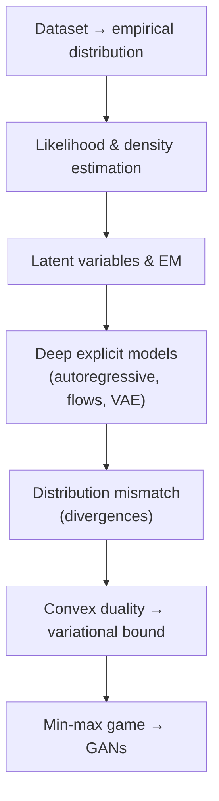

A one-screen map of the journey:


Generative modeling is the art of **learning to sample**.
Given a dataset (images, text, audio, tabular records, or multimodal pairs), we want a model that can generate new samples that look like they came from the same underlying *data-generating process* — formally, an unknown “true” distribution $ (P_{\mathrm{data}}) $ on an appropriate data space $ (\mathcal{X}) $. This “true distribution” is not something we ever observe directly; it is a **modeling abstraction** that says: there exists some probability law that could, in principle, produce the kind of examples we see. What changes across modalities is the space $ (\mathcal{X}) $ and what “probability” means. 

For **text**, a datapoint is usually a token sequence $ (x_{1:T}) $ over a vocabulary, so $ (P_{\mathrm{data}}) $ is a *discrete* distribution (a PMF) over all possible sequences. In other words, it assigns probability mass to every possible sentence, paragraph, or document, including ones you never saw in the dataset. For **audio**, a datapoint might be a waveform (continuous amplitudes) or quantized samples (discrete PCM values), so $ (P_{\mathrm{data}}) $ can be modeled as a continuous density or a discrete mass function depending on representation. For **multimodal data** (e.g., text–image, vision–audio, or text–audio), the most faithful object is a **joint distribution** $ (P_{\mathrm{data}}(x^{(a)},x^{(b)})) $ over paired modalities (caption and image, video and sound), and many tasks are naturally expressed as **conditional** generation, like $ (P_{\mathrm{data}}(\text{image}\mid \text{text})) $ or $ (P_{\mathrm{data}}(\text{audio}\mid \text{video})) $. So “learning the distribution” can mean learning the joint, the conditional, or both. 

In large language models like GPT based models, $ (P_{\mathrm{data}}) $ should be understood as the distribution induced by the **data collection and filtering pipeline** (a huge but still incomplete slice of the world’s text: web pages, books, code, and other sources), not literally “the entire internet.” The generative goal is the same across all modalities: not copying training examples, but learning the statistical regularities — syntax, semantics, style, structure, and cross-modal alignment — that make the data what it is, so that new samples are plausible under the same underlying process.

This post is a timeline, but it is also a logic chain.
1. We start from the most basic question — *what is a dataset, mathematically?* — and build up the probabilistic objects we will need (distributions, densities, expectations). 
2. Then we move through classical density estimation (MLE, KDE, Bayesian thinking), into latent-variable models (mixtures, EM), and finally into deep generative models (autoregressive models, flows, VAEs). 
3. At the end, we show why GANs appear naturally when you try to minimize distribution mismatch without a tractable likelihood.

---

## 0. From a dataset to a distribution

### 0.1 What a dataset is (mathematically)

A dataset is a finite collection of observations.
To do probability with it, we treat each observation as a point in a space $ \(\mathcal{X}\) $, and we treat the dataset as samples from an unknown distribution.

$$
\mathcal{D}=\{x^{(1)},x^{(2)},\ldots,x^{(n)}\},
\qquad
x^{(i)} \stackrel{\text{i.i.d.}}{\sim} P_{\mathrm{data}}.
$$

This single line is the “probabilistic starting point” of almost all generative modeling.
It says that there exists an unknown distribution $ \(P_{\mathrm{data}}\) $ over the data space $ \(\mathcal{X}\) $, and our dataset $ \(\mathcal{D}\) $ is generated by drawing $ \(n\) $ samples from that distribution.
The symbol “i.i.d.” means independent and identically distributed: each example is drawn from the same distribution, and the draws are independent of each other.
This does not claim that the *components* of an example are independent; it only models different examples (different images, different sentences) as separate draws.
The i.i.d. assumption is the bridge that lets us replace expectations with averages, which is what makes mini-batch training meaningful.
When i.i.d. is wrong (time series, trajectories, dialogue), we will still use the same distributional thinking, but the model will be conditional or sequential.
So before learning any model, we commit to this idea: data is not just a list of files, it is a finite window into a much bigger distribution.

### 0.2 The empirical distribution

A dataset gives you samples, not the true distribution. or A dataset gives you **examples**, not the full “rule” that created them.
One useful “distribution built from the dataset” is the empirical distribution, which places equal mass on each observed point.
Or in other words, A simple way to turn the dataset into a probability distribution is the **empirical distribution**: imagine a bag that contains exactly your (n) training examples, each appearing once. If you pick one item uniformly at random from that bag, every training example has probability (1/n). That “uniform-over-the-dataset” rule is $ (\widehat{P}_n) $.

$$
\widehat{P}_n=\frac{1}{n}\sum_{i=1}^{n}\delta_{x^{(i)}},
\qquad
\widehat{P}_n(A)=\frac{1}{n}\sum_{i=1}^{n}\mathbf{1}\{x^{(i)}\in A\}.
$$

Here $ \(\delta_{x^{(i)}}\) $ is a Dirac measure concentrated at the point $ \(x^{(i)}\) $, and $ \(\mathbf{1}\{\cdot\}\) $ is an indicator function that equals $ \(1\) $ when its condition is true and $ \(0\) $ otherwise. The symbol $ (\delta_{x^{(i)}}) $ means “**all probability mass is placed at the single point** $ (x^{(i)}) $” (a mathematical way to say “choose exactly that sample”).

The indicator $ (\mathbf{1}{x^{(i)}\in A}) $ is just a yes/no counter: it equals (1) if the sample $ (x^{(i)}) $ falls inside the set (A), otherwise (0). So $ (\widehat{P}_n(A)) $ simply counts **what fraction of your dataset lies in (A)**.

Why this matters: sampling from $ (\widehat{P}_n) $ can only return **copies of training examples**, because it assigns probability only to the points you already observed. 

That’s pure memorization. A generative model tries to learn a smoother, more general distribution $ (P_\theta) $ that explains the dataset but also assigns probability to **new, plausible points** not explicitly present in $ (\mathcal{D}) $. 

Many learning objectives can be read as: 
make $$ (P_\theta) $$ close to $$ (\widehat{P}_n) $$  and therefore close to the unknown $$ (P_{\mathrm{data}}) $$ in a principled way.

So $ (\widehat{P}_n) $ is not the final goal, but it is the clean “starting distribution” that makes it clear what we have (finite samples) and what we want (a true generative distribution that generalizes).

### 0.3 Random variables and data spaces

A random variable is a measurable function from an abstract probability space into a value space. You can think of this as a “random sample generator” that outputs one data example each time you run it. In practice, you can think of it as “a draw from a distribution,” but it helps to be explicit about the space.

$$
X:\Omega\to\mathcal{X},
\qquad
X\sim P_{\mathrm{data}},
\qquad
x^{(i)}=X(\omega_i).
$$

The notation $ \(X:\Omega\to\mathcal{X}\) $ means the random variable $ \(X\) $ takes an underlying random outcome $ \(\omega\in\Omega\) $ and maps it to a concrete datapoint $ \(x\in\mathcal{X}\) $.  You can think of this as: “there is a hidden random seed $ \(\omega\) $, and when you plug it into the real-world generator $ \(X\) $, you get one sample $ \(x\) $.”

The statement $ \(X\sim P_{\mathrm{data}}\) $ means the outputs of $ \(X\) $ follow the (unknown) data distribution $ \(P_{\mathrm{data}}\) $.  
Think of this as: “the real world has a rule for how likely different kinds of samples are, and $ \(P_{\mathrm{data}}\) $ is that rule.”

Each dataset example $ \(x^{(i)}\) $ is one realized value of $ \(X\) $ for some outcome $ \(\omega_i\in\Omega\) $, written $ \(x^{(i)}=X(\omega_i)\) $. This implies: “your dataset is what you got after pressing the ‘generate real data’ button $ \(n\) $ times with $ \(n\) $ different hidden seeds.”

<aside><p>
<strong>Why is \(\Omega\) abstract?</strong><br>
Mathematically, \(\Omega\) is the set of all possible “random outcomes,” but we almost never need to describe it explicitly.  
You can think of \(\Omega\) as a bookkeeping device for randomness: it represents everything that could vary in the world (lighting, pose, background, word choice, microphone noise, camera motion), without forcing us to list those factors one by one.
</p></aside>


#### What is the data space $ \(\mathcal{X}\) $?

The space $ \(\mathcal{X}\) $ is the set of all valid objects your dataset lives in (all possible images, all possible videos, all possible sequences, etc.). You can think of $ \(\mathcal{X}\) $ as the “format” of your data: whatever can be represented as a valid example counts as a point in $\(\mathcal{X}\)$.

**Example: RGB images.** An RGB image of height $ \(H\) $ and width $ \(W\) $ has $ \(H\times W\times 3\) $ pixel values. After flattening one image tensor, it becomes a very large vector made of numbers. In literature, this large vector is represented by $ (d) $ and is also known as the dimensionality of one sample in our dataset.

For example, If the resolution of an image in the image dataset is 400x400, then the value of $ d = \(H\times W\times 3\) = (400\times 400\times 3) = 480,000 $.

If pixels are stored as integers, a natural data space is:
$$
\mathcal{X}=\{0,1,\ldots,255\}^{H\times W\times 3}.
$$
This means: “each pixel channel is one of 256 discrete values, so the whole image is a huge grid of discrete numbers.”

If pixels are normalized to real values (common in deep learning pipelines), a natural data space is:
$$
\mathcal{X}=[0,1]^{H\times W\times 3}.
$$
This means: “each pixel channel is a real number between 0 and 1, so the image lives in a continuous space.”

**Example: videos.** A video clip with $ \(T\) $ frames is a sequence of images, so its tensor shape is $ \(T\times H\times W\times 3\) $.  
A video can be interpreted as “an image, repeated over time,” which makes the data object even higher-dimensional.

A corresponding discrete space is:
$$
\mathcal{X}=\{0,1,\ldots,255\}^{T\times H\times W\times 3},
$$
and a corresponding continuous space is:
$$
\mathcal{X}=[0,1]^{T\times H\times W\times 3}.
$$
In other words, you can think of these as: “all possible valid video clips of that length and resolution, either stored as integers or as normalized real values.”

For text, $ \(\mathcal{X}\) $ is often a space of token sequences; for tabular data, it is a product space mixing continuous and categorical coordinates.

#### Why does choosing $ \(\mathcal{X}\) $ matter (PMF vs PDF)?

Stating $ \(\mathcal{X}\) $ forces you to decide whether your model should treat outcomes as discrete or continuous, which determines whether probabilities are computed by sums (PMF) or by integrals (PDF).  
In other words, you can think of this as: “if your data values are countable choices, you add probabilities; if your data values are real-valued, you integrate densities.”

This is where vector-valued random variables naturally appear: an image (or video) is not a single number but a high-dimensional vector/tensor random variable.  In other words, you can think of generative modeling as learning a probability law over *entire structured objects*, not just over scalars.

#### Mental model: “two machines”

There is a real (unknown) machine that generates data according to $ \(P_{\mathrm{data}}\) $, and your dataset is a finite set of its outputs.  
In other words, you can think of the world as a black-box generator you can sample from, but you cannot inspect directly.

A generative model builds a new machine $ \(P_\theta\) $ (or a sampler $ \(x=g_\theta(z)\) $) that tries to produce outputs with the same statistical patterns as the real machine.  
In other words, you can think of training as: “tune the knobs $ \(\theta\) $ until the fake samples become indistinguishable (in distribution) from the real ones.”

Once you internalize this dataset $ \\rightarrow\ $ random variable $ \\rightarrow\ $ distribution view, most generative models become variations on one theme: pick a model family on $ \(\mathcal{X}\) $, and fit it from samples.  
In other words, you can think of the rest of this post as exploring different “machines” (MLE, EM, VAEs, GANs) that all aim to learn the same kind of object: a good approximation to $ \(P_{\mathrm{data}}\) $.


---

## 1. Probability building blocks you will actually use

This section is short on purpose, but it is extremely important.
Almost every generative model is just a clever way to compute (or avoid computing) these three things:
(1) probabilities of events, (2) how to relate joint/marginal/conditional distributions, and (3) how to replace integrals with averages over data.

---

### 1.1 PMF vs PDF vs CDF (and why it matters)

A key idea: **probability is about a region or a set of outcomes**, not about a single exact point (when things are continuous).

If $ \(X\) $ is **continuous** (like a real-valued measurement), we use a **probability density function** (PDF) $ \(p(x)\) $ and compute event probabilities by *integrating*:

$$
P(X\in A)=\int_A p(x)\,dx \quad \text{(continuous PDF)}.
$$

If $ \(X\) $ is **discrete** (like a token ID or an integer-valued pixel), we use a **probability mass function** (PMF) $ \(p(x)=P(X=x)\) $ and compute event probabilities by *summing*:

$$
P(X\in A)=\sum_{x\in A} p(x) \quad \text{(discrete PMF)}.
$$

In other words, you can think of it like this:
- A **PMF** is like a table of probabilities for each possible outcome (token 42, pixel value 128, class “cat”, etc.).
- A **PDF** is like a “height map” over a continuous line/space; probability comes from the **area under the curve** over a region.

A very common confusion is: “why isn’t $ \(p(x)\) $ itself a probability in the continuous case?”
Because for a continuous variable, the probability of hitting exactly one point is essentially zero.
So a PDF value $ \(p(x)\) $ is more like “how concentrated the distribution is near $ \(x\) $,” and the real probability comes from integrating over an interval/region around $ \(x\) $.

```vega_lite
{
  "$schema": "https://vega.github.io/schema/vega-lite/v5.json",
  "hconcat": [
    {
      "width": 260,
      "height": 180,
      "title": "PMF (discrete)",
      "data": { "values": [
        {"x": 0, "p": 0.10}, {"x": 1, "p": 0.25}, {"x": 2, "p": 0.40}, {"x": 3, "p": 0.20}, {"x": 4, "p": 0.05}
      ]},
      "mark": "bar",
      "encoding": {
        "x": {"field": "x", "type": "ordinal", "title": "outcome x"},
        "y": {"field": "p", "type": "quantitative", "title": "p(x)"}
      }
    },
    {
      "width": 260,
      "height": 180,
      "title": "PDF (continuous): probability = area",
      "data": { "values": [
        {"x": -3, "y": 0.004}, {"x": -2, "y": 0.054}, {"x": -1, "y": 0.242},
        {"x": 0, "y": 0.399}, {"x": 1, "y": 0.242}, {"x": 2, "y": 0.054}, {"x": 3, "y": 0.004}
      ]},
      "layer": [
        {
          "mark": {"type": "line"},
          "encoding": {
            "x": {"field": "x", "type": "quantitative", "title": "value x"},
            "y": {"field": "y", "type": "quantitative", "title": "p(x)"}
          }
        },
        {
          "transform": [{"filter": "datum.x >= -1 && datum.x <= 1"}],
          "mark": {"type": "area", "opacity": 0.25},
          "encoding": {
            "x": {"field": "x", "type": "quantitative"},
            "y": {"field": "y", "type": "quantitative"}
          }
        }
      ]
    }
  ]
}
```

**Why it matters in ML (a real example).**  
In image modeling, you must decide how you treat pixel values:
- If pixels are treated as integers in $ \(\{0,\ldots,255\}\) $, then your model outputs a **PMF** (often categorical probabilities).
- If pixels are treated as real numbers in $ \([0,1]\) $, then your model outputs a **PDF** (often Gaussian or logistic-like).

In other words, you can think of this as choosing the “measurement type”:
are pixel values “countable categories” (discrete) or “real measurements” (continuous)?
This choice changes the likelihood $ \(p_\theta(x)\) $ and therefore changes the training signal.

**What about the CDF?**  
The cumulative distribution function (CDF) is $ \(F(t)=P(X\le t)\) $.
It is very useful in 1D because “$ \(\le\) $” makes sense on a line.
But in high-dimensional data (images, audio spectrograms, embeddings), there is no natural single “$ \(\le\) $” ordering for vectors.
That is why deep generative modeling usually uses PDFs/PMFs (or samples) rather than CDFs.

```vega_lite
{
  "$schema": "https://vega.github.io/schema/vega-lite/v5.json",
  "width": 260,
  "height": 180,
  "title": "CDF (continuous): F(t)",
  "data": {
    "values": [
      {"x": -3, "F": 0.001},
      {"x": -2, "F": 0.023},
      {"x": -1, "F": 0.159},
      {"x": 0,  "F": 0.500},
      {"x": 1,  "F": 0.841},
      {"x": 2,  "F": 0.977},
      {"x": 3,  "F": 0.999}
    ]
  },
  "layer": [
    {
      "mark": {"type": "line"},
      "encoding": {
        "x": {"field": "x", "type": "quantitative", "title": "threshold t"},
        "y": {"field": "F", "type": "quantitative", "title": "F(t)", "scale": {"domain": [0, 1]}}
      }
    },
    {
      "mark": {"type": "point", "filled": true, "size": 40},
      "encoding": {
        "x": {"field": "x", "type": "quantitative"},
        "y": {"field": "F", "type": "quantitative"},
        "tooltip": [
          {"field": "x", "type": "quantitative", "title": "t"},
          {"field": "F", "type": "quantitative", "title": "F(t)", "format": ".3f"}
        ]
      }
    },
    {
      "data": {"values": [{"x0": -1, "x1": -1, "y0": 0, "y1": 0.159}]},
      "mark": {"type": "rule", "strokeDash": [4, 4]},
      "encoding": {
        "x": {"field": "x0", "type": "quantitative"},
        "y": {"field": "y0", "type": "quantitative"},
        "y2": {"field": "y1"}
      }
    },
    {
      "data": {"values": [{"x0": -3, "x1": -1, "y0": 0.159, "y1": 0.159}]},
      "mark": {"type": "rule", "strokeDash": [4, 4]},
      "encoding": {
        "x": {"field": "x0", "type": "quantitative"},
        "x2": {"field": "x1"},
        "y": {"field": "y0", "type": "quantitative"}
      }
    }
  ]
}
```
---

### 1.2 Joint, marginal, conditional

Real data often has multiple parts.
For example:
- An image $ \(X\) $ and its label $ \(Y\) $
- A video frame $ \(X_t\) $ and the previous frame $ \(X_{t-1}\) $
- Text $ \(Y\) $ describing an image $ \(X\) $

Probability gives us a consistent way to relate “together” vs “separate” vs “given.”

$$
p(x,y)=p(x\mid y)\,p(y),
\qquad
p(x)=\int p(x,y)\,dy \ \text{(continuous)},
\qquad
p(x)=\sum_y p(x,y) \ \text{(discrete)}.
$$

In other words, you can think of these as three basic operations:

1) **Joint** $ \(p(x,y)\) $: “how likely is it to see $ \(x\) $ and $ \(y\) $ together?”  
   Example: “this image AND this caption.”

2) **Conditional** $ \(p(x\mid y)\) $: “how likely is $ \(x\) $ if I already know $ \(y\) $?”  
   Example: “generate an image GIVEN the caption.”

3) **Marginal** $ \(p(x)\) $: “how likely is $ \(x\) $ overall, if I don’t care about $ \(y\) $?”  
   To get this, you *remove* (marginalize) $ \(y\) $ by summing or integrating it out.

This is exactly where generative modeling becomes hard:
marginalization is often expensive or intractable when $ \(y\) $ is high-dimensional or unobserved.
For latent-variable models, $ \(y\) $ is the latent variable (hidden cause) that you do not see, but you still need to account for it.
So “learning a distribution” often becomes:
learn a joint model $ \(p(x,y)\) $ and also learn a practical way to marginalize $ \(y\) $.

This is why later methods appear:
- EM is a clever way to deal with hidden discrete variables.
- VAEs use a variational approximation to handle hidden continuous variables.
- GANs avoid explicit marginal likelihoods and instead match distributions using a critic.

---

### 1.3 Expectations, Monte Carlo, and why mini-batches work

Most learning objectives in ML are written as an **expectation**.
An expectation is just the “average value” of something under a distribution.

$$
\mathbb{E}_{X\sim P}[h(X)]
=
\int h(x)\,p(x)\,dx
\approx
\frac{1}{n}\sum_{i=1}^{n} h\!\left(x^{(i)}\right),
\quad x^{(i)}\sim P.
$$

In other words, you can think of this as:
- The left side is the “true average” we would like to compute (over all possible images/text/audio that could exist under $ \(P\) $).
- The right side is what we can actually compute: an average over a finite dataset (samples we have).

This approximation is called **Monte Carlo estimation**:
you replace an impossible integral with a sample average.
This is the reason modern ML works:
we cannot “sum over all possible images,” but we can average over the images in our dataset.

**Why mini-batches work.**  
Mini-batch training is just doing the same sample-average idea, but using a smaller random subset per step.
You get a noisy estimate of the expectation, but it is fast and still points in the right direction on average.

The i.i.d. assumption matters here because it is what justifies the idea that “averaging over samples approximates averaging over the distribution.”
So whenever you see a loss written as $ \(\mathbb{E}[\cdot]\) $, a good mental translation is:
“this is something we will estimate by averaging over the dataset (or a mini-batch).”

Once you understand this expectation viewpoint, many generative methods become easier to compare:
they differ mainly in (1) which distribution the expectation uses and (2) what function $ \(h\) $ is being averaged.

---

## 2. What it means to learn a generative model

This section answers one question: *what are we actually learning when we train a generative model?*  In other words, you can think of this as: we want to build a new machine that produces data-like samples, and we need a principled way to tune it.

---

### 2.1 The modeling contract

A generative model is a **family of probability distributions** $ \(\{P_\theta\}\) $ controlled by parameters $ \(\theta\) $ (for neural networks, these are the weights). This simply means that the architecture stays the same, but different settings of $ \(\theta\) $ produce different “styles” of generated samples.

We assume the dataset comes from an unknown “true” distribution $ \(P_{\mathrm{data}}\) $, and training means choosing $ \(\theta\) $ so that the model distribution $ \(P_\theta\) $ becomes close to $ \(P_{\mathrm{data}}\) $. Here the dataset is a finite set of clues about a hidden rule, and we are trying to learn a good approximation of that rule.

A compact way to write the goal is:

$$
\theta^\star \in \arg\min_{\theta}\; D\!\left(P_{\mathrm{data}} \,\|\, P_\theta\right).
$$

Here $ \(D(\cdot\|\cdot)\) $ is a discrepancy (a distance-like measure) between two distributions.  
We can think of $ \(D\) $ as a score that says “how different the outputs of these two machines are, statistically.”

This equation is abstract on purpose because it captures the shared structure behind many methods.

The entire history of generative modeling can be seen as different choices of:

1) the model family $ \(P_\theta\) $ (what kind of machine we build), and  
2) the discrepancy $ \(D\) $ (how we decide what “close” means).

**Practical example (images).**  
Suppose your dataset contains thousands of cat images. Then $ \(P_{\mathrm{data}}\) $ is the unknown distribution that produces cat-like images with the same variety of poses, lighting, backgrounds, and styles.  Here for simplicity, you can think of $ \(P_{\mathrm{data}}\) $ as “the cat-image world” that your dataset sampled from.

Your model chooses some $ \(\theta\) $, which defines $ \(P_\theta\) $, and training tries to make samples from $ \(P_\theta\) $ look statistically like samples from $ \(P_{\mathrm{data}}\) $.  Training is repeatedly adjusting the knobs until the generated examples match the dataset’s patterns.

> Important nuance: we never directly observe $ \(P_{\mathrm{data}}\) $.  
> We only see samples. So in practice we estimate $ \(D\) $ from mini-batches of real and generated data.  
We compare the machines by comparing many examples from each, not by inspecting their full distributions.

---

### 2.2 Explicit vs implicit models

Generative models differ in a crucial capability: whether they let you **evaluate the likelihood** (the probability mass or density) of a given observation.  In other words, you can think of this as: can the model not only generate an image, but also assign a reliable “probability score” to a specific image?

A useful classification is:

$$
\textbf{Explicit model: can evaluate } p_\theta(x)
$$

$$
\qquad \textbf{vs} \qquad
$$

$$
\textbf{Implicit model: can sample } x\sim P_\theta \textbf{ but cannot evaluate } p_\theta(x).
$$

In an **explicit** model, the likelihood $ \(p_\theta(x)\) $ is tractable (a PMF for discrete data or a PDF for continuous data).  Explicit models are “models with a visible scoring rule” for any sample.

This makes training straightforward in principle: you can do maximum likelihood by maximizing $ \(\log p_\theta(x)\) $ on the dataset. You can think of it as: “push the model to assign higher probability to real data.”

Examples include:
- **Autoregressive models**, which build the joint distribution from many conditional probabilities.
- **Normalizing flows**, which use invertible transformations to compute likelihood exactly.  
In other words, you can think of explicit models as great for likelihood-based evaluation, but they may require architectural constraints for tractability.

In an **implicit** model, you can sample from the model but you cannot compute a tractable likelihood $ \(p_\theta(x)\) $.  
Simply, you can think of implicit models as “sample generators without an explicit probability score.”

GANs are the classic example: sample noise $ \(z\sim P_Z\) $, generate $ \(x=g_\theta(z)\) $, but do not compute $ \(p_\theta(x)\) $.  
A GAN generator is just like a painter: it can create images, but it doesn’t output a probability for a given image.

This difference explains two practical consequences:
- **Evaluation:** explicit models can be compared using log-likelihood; implicit models usually need sample-based metrics.
- **Training:** if you cannot compute $ \(p_\theta(x)\) $, you cannot do MLE directly, so you need objectives that depend only on samples (like adversarial training).  
Implicit models are “trained by comparing sets of samples,” not by scoring individual datapoints with likelihood.

---

### 2.3 Pushforward distributions (a key modern idea)

A very common modern assumption is: complex data can be generated from a simpler random variable $ \(Z\) $ through a deterministic mapping. This means we can start with simple noise, then transform it into a structured object like an image.

We write:

$$
Z \sim P_Z,
\qquad
\widehat{X} = g_\theta(Z),
\qquad
P_\theta = (g_\theta)_{\#} P_Z.
$$

Here $ \(P_Z\) $ is a simple base distribution (often $ \(\mathcal{N}(0,I)\) $), and $ \(g_\theta\) $ is a generator network.  
In other words, you can think of $ \(Z\) $ as a random seed, and $ \(g_\theta\) $ as a learned program that converts that seed into data.

The notation $$ (g_\theta)_{\#}P_Z $$ means the **pushforward distribution**: the distribution of $ \(\widehat{X}=g_\theta(Z)\) $. 

**“Whatever distribution you get after pushing noise through the generator.”**

This idea is powerful because it keeps sampling easy (sample $ \(Z\) $) while allowing complex outputs (through $ \(g_\theta\) $).  
In other words, you can think of it as: we avoid writing down a complicated distribution directly, and instead learn a complicated transformation of a simple one.

<aside><p>
<strong>Side note: what does the “\(\#\)” symbol mean in \( (g_\theta)_{\#}P_Z \)?</strong><br>
The symbol “\(\#\)” here is <em>not</em> a comment marker. It is standard shorthand for the <strong>pushforward distribution</strong> (also called the “image measure”).  
In other words, you can think of \( (g_\theta)_{\#}P_Z \) as: “take samples \(z\) from \(P_Z\), run them through \(g_\theta\), and look at the distribution of the outputs.”

Formally, if we define \( \widehat{X}=g_\theta(Z) \) with \( Z\sim P_Z \), then the induced distribution \(P_\theta\) over outputs satisfies:
$$
P_\theta(A)=P(\widehat{X}\in A)=P_Z\!\left(g_\theta^{-1}(A)\right)
\quad \text{for any measurable set } A\subseteq\mathcal{X}.
$$
In other words, you can think of this as: the probability that the generated sample lands in region \(A\) equals the probability that the latent noise lands in the set of points that map into \(A\).

If you prefer more familiar notation, you can avoid “\(\#\)” entirely and write the same idea as:
$$
Z\sim P_Z,\quad \widehat{X}=g_\theta(Z),\quad \widehat{X}\sim P_\theta.
$$
In other words, you can think of this as: “\(P_\theta\) is simply the distribution of the random output \(\widehat{X}\).”
</p></aside>

**Sanity-check example (1D).**  
If $ \(Z\sim\mathcal{N}(0,1)\) $ and $ \(g_\theta(z)=a z+b\) $, then $ \(\widehat{X}\sim\mathcal{N}(b,a^2)\) $.  
Scaling and shifting Gaussian noise gives another Gaussian, and deep generators do the same thing but in a much richer, nonlinear way.

The pushforward view is the backbone behind many families (VAEs, GANs, flows, diffusion). We can think of many “different” generative models as different ways to design and train the mapping from simple randomness to complex data.


---

## 3. Classical density estimation

Classical generative modeling starts with a straightforward goal: **write down a probability model for the data** and fit its parameters from samples.
This approach is attractive because it gives a clear training signal: if the model assigns high probability to the observed dataset, it is doing something sensible.
The main limitation is also clear: if the model family is too simple, the fitted model will be a “best effort” inside that family, even if reality is more complex.
This section explains the core ideas with small, concrete examples before we move to richer model families.

---

### 3.1 Maximum likelihood estimation (MLE)

In MLE, you pick a parametric family $ \(\{p_\theta(x)\}\) $ and choose parameters $ \(\theta\) $ that make the observed dataset most likely under the model.
Here $ \(p_\theta(x)\) $ is a **PMF** if $ \(x\) $ is discrete, and a **PDF** if $ \(x\) $ is continuous, but the training rule looks the same because we always combine independent samples.

$$
\widehat{\theta}_{\mathrm{MLE}}
=
\arg\max_{\theta}\prod_{i=1}^{n} p_\theta\!\left(x^{(i)}\right)
=
\arg\max_{\theta}\sum_{i=1}^{n}\log p_\theta\!\left(x^{(i)}\right).
$$

The left form multiplies probabilities/densities across samples because the dataset is modeled as i.i.d. draws.
The right form uses logs to turn the product into a sum, which is numerically stable and matches how loss functions are implemented.
This objective has two assumptions built in: the true data distribution can be approximated by the chosen family, and “best” means maximizing the probability assigned to the observed data.
A practical way to read MLE is: it pushes the model to place high probability mass (discrete) or high density (continuous) in the regions where the dataset lies.
If the model family cannot represent the dataset’s structure (for example, fitting one Gaussian to data with multiple clusters), MLE still converges, but to the best approximation *within the wrong family*.
That is why the history of generative modeling keeps revisiting the same pattern: keep the likelihood idea, but make the model family richer.

---

### 3.2 Likelihood vs probability

A common confusion is to read likelihood as “the probability of parameters.”
In frequentist statistics, $ \(\theta\) $ is treated as a fixed but unknown quantity, and likelihood is a function that scores different values of $ \(\theta\) $ based on the observed data.

$$
\mathcal{L}(\theta;\mathcal{D})
=
p_\theta(\mathcal{D})
=
\prod_{i=1}^{n} p_\theta\!\left(x^{(i)}\right),
\qquad
\text{but } \mathcal{L}(\theta;\mathcal{D}) \neq p(\theta\mid \mathcal{D}).
$$

“$ \(\mathcal{L}(\theta;\mathcal{D})\) $ = the likelihood of parameters $ \theta $ evaluated on the dataset $ \mathcal{D} $ ”.

The likelihood function $ \(\mathcal{L}(\theta;\mathcal{D})\) $ ranks parameter settings: higher likelihood means “this $ \(\theta\) $ explains the data better under the model assumptions.”
It is not a probability distribution over $ \(\theta\) $ because it does not need to integrate (or sum) to $ \(1\) $ over all possible $ \(\theta\) $.
A probability like $ \(p(\theta\mid \mathcal{D})\) $ is a **posterior** from Bayesian inference, which requires a prior and Bayes’ rule.
Keeping this distinction clear matters in practice: MLE returns a single best parameter value, while Bayesian inference returns a whole distribution over parameters that represents uncertainty.
In deep learning, people often say “likelihood of $ \(\theta\) $,” but the correct meaning is “likelihood evaluated at $ \(\theta\) $.”
This clarity becomes essential later when you see objectives involving KL divergences and distributions over latent variables.

---

### 3.3 Worked micro-example 1: 1D Gaussian MLE

Assume $ \(x^{(1)},\ldots,x^{(n)}\in\mathbb{R}\) $ were generated from a normal distribution with mean $ \(\mu\) $ and variance $ \(\sigma^2>0\) $.
The Gaussian PDF is:

$$
p(x\mid \mu,\sigma^2)
=
\frac{1}{\sqrt{2\pi\sigma^2}}
\exp\!\left(-\frac{(x-\mu)^2}{2\sigma^2}\right).
$$

This single formula already encodes strong assumptions: the distribution is unimodal, symmetric around $ \(\mu\) $, and fully described by just two parameters.
The normalization constant $ \(1/\sqrt{2\pi\sigma^2}\) $ ensures the density integrates to $ \(1\) $, and it depends on $ \(\sigma^2\) $ because a wider distribution must have a lower peak.
The exponent term gives higher density to values near $ \(\mu\) $ and decreases as $ \(x\) $ moves away, with the speed controlled by $ \(\sigma^2\) $.
This model is also generative in the most direct sense: draw noise $ \(\varepsilon\sim\mathcal{N}(0,1)\) $ and output $ \(x=\mu+\sigma\varepsilon\) $.
Gaussian models were historically popular because they allow clean math and easy sampling.
They are also limited: a single Gaussian cannot represent multiple clusters, heavy tails, or complex constraints.

The log-likelihood of the dataset under this model is:

$$
\ell(\mu,\sigma^2)
=
\sum_{i=1}^{n}\log p(x^{(i)}\mid\mu,\sigma^2)
=
-\frac{n}{2}\log(2\pi\sigma^2)
-\frac{1}{2\sigma^2}\sum_{i=1}^{n}\left(x^{(i)}-\mu\right)^2.
$$

This equation makes MLE feel concrete: maximizing $ \(\ell(\mu,\sigma^2)\) $ is the same as fitting the center and spread that best explain the samples.
The second term is a scaled sum of squared deviations, so choosing $ \(\mu\) $ is tightly linked to “least squares” thinking.
The first term prevents the model from cheating by shrinking $ \(\sigma^2\) $ toward zero to create an infinitely sharp spike on the data.
Most importantly, $ \(\ell\) $ is not a probability of parameters; it is a score that compares different $ \((\mu,\sigma^2)\) $ values.
This is the basic template for explicit generative modeling: define $ \(p_\theta(x)\) $, compute $ \(\log p_\theta(x)\) $, sum over the dataset, and maximize.
Later, when we cannot compute a likelihood exactly, we will replace this step with EM, variational bounds, or adversarial training.

Solving $ \(\nabla \ell = 0\) $ yields the closed-form MLE:

$$
\widehat{\mu}=\frac{1}{n}\sum_{i=1}^{n}x^{(i)},
\qquad
\widehat{\sigma}^2=\frac{1}{n}\sum_{i=1}^{n}\left(x^{(i)}-\widehat{\mu}\right)^2.
$$

The estimate $ \(\widehat{\mu}\) $ is the sample mean, matching the intuition that the best Gaussian “center” is the average of observed values.
The variance estimate uses denominator $ \(n\) $ (not $ \(n-1\) $) because this is MLE, not the classical unbiased estimator.
This highlights an important lesson: MLE optimizes likelihood under the assumed model, not unbiasedness under the true unknown distribution.
Closed-form solutions like this made early probabilistic modeling elegant and practical.
As models become more expressive, analytic solutions disappear, and iterative optimization becomes the norm.

---

### 3.4 KDE in one equation (and why it breaks in high dimensions)

If you do not want to commit to a specific parametric family, you can estimate a density directly from samples using kernel density estimation (KDE).
Given data in $ \(\mathbb{R}^d\) $, KDE is:

$$
\widehat{p}_h(x)
=
\frac{1}{n\,h^d}
\sum_{i=1}^{n}
K\!\left(\frac{x-x^{(i)}}{h}\right).
$$

Symbol glossary (KDE).

$n$: number of samples in the dataset.

$d$: data dimension (e.g., $d=1$ for scalars, $d=H\times W\times 3$ for flattened RGB images).

$x\in\mathbb{R}^d$: the point where we want to estimate density.

$x^{(i)}$: the $i$-th observed datapoint.

$K(\cdot)$: the kernel (a smooth “bump,” often Gaussian), centered at each sample.

$h>0$: the bandwidth (smoothing scale).

$h^d$: a volume-scaling term that grows/shrinks with dimension.

$ \widehat{p}_h(x)$: the KDE estimate of the true (unknown) density $p(x)$.

Intuition. KDE places a smooth bump $K(\cdot)$ around every datapoint $x^{(i)}$ and averages those bumps.

The bandwidth $h$ controls the tradeoff:

- small $h$ → sharp, spiky estimate (can overfit / memorize),

- large $h$ → very smooth estimate (can wash out structure).

KDE places a smooth “bump” $ \(K(\cdot)\) $ around each datapoint and averages them.
The bandwidth $ \(h\) $ controls smoothness: small $ \(h\) $ makes narrow bumps (spiky estimate), large $ \(h\) $ makes wide bumps (over-smoothed estimate).
In one dimension, KDE behaves like a smoothed histogram and is easy to visualize: with enough samples and a sensible $ \(h\) $, it approximates the true curve well.
The problem appears in the factor $ \(h^d\) $: as dimension $ \(d\) $ grows, volume grows explosively, and “local neighborhoods” become mostly empty unless the dataset size is enormous.
For images, $ \(d\) $ can be hundreds of thousands, so KDE in raw pixel space is not practical.
This failure is useful to remember because it explains why modern methods rely on structure: factorization (autoregressive models), latent spaces (VAEs/GANs), or learned representations.
KDE shows the core difficulty in the simplest possible form: density estimation is easy in low dimensions, and extremely hard in high dimensions without additional assumptions.

```vega_lite
{
  "$schema": "https://vega.github.io/schema/vega-lite/v5.json",
  "width": 600,
  "height": 260,
  "title": {
    "text": "KDE bandwidth intuition (toy 1D dataset)",
    "anchor": "start",
    "fontSize": 16
  },
  "data": {
    "values": [
      {"x": -2.3}, {"x": -1.8}, {"x": -1.4}, {"x": -0.6}, {"x": -0.2},
      {"x": 0.05}, {"x": 0.25}, {"x": 0.9}, {"x": 1.3}, {"x": 1.8}, {"x": 2.25}
    ]
  },
  "layer": [
    {
      "transform": [
        {
          "density": "x",
          "bandwidth": 0.15,
          "extent": [-3, 3],
          "steps": 200,
          "as": ["x", "density"]
        }
      ],
      "mark": {"type": "line", "tooltip": true},
      "encoding": {
        "x": {"field": "x", "type": "quantitative", "title": "x"},
        "y": {"field": "density", "type": "quantitative", "title": "estimated density  p̂_h(x)"},
        "color": {"datum": "h = 0.15 (spiky)", "type": "nominal", "title": "bandwidth"},
        "tooltip": [
          {"field": "x", "type": "quantitative", "format": ".2f"},
          {"field": "density", "type": "quantitative", "format": ".4f"}
        ]
      }
    },
    {
      "transform": [
        {
          "density": "x",
          "bandwidth": 0.60,
          "extent": [-3, 3],
          "steps": 200,
          "as": ["x", "density"]
        }
      ],
      "mark": {"type": "line", "tooltip": true},
      "encoding": {
        "x": {"field": "x", "type": "quantitative"},
        "y": {"field": "density", "type": "quantitative"},
        "color": {"datum": "h = 0.60 (smooth)", "type": "nominal", "title": "bandwidth"},
        "tooltip": [
          {"field": "x", "type": "quantitative", "format": ".2f"},
          {"field": "density", "type": "quantitative", "format": ".4f"}
        ]
      }
    },
    {
      "mark": {"type": "tick", "thickness": 2, "size": 18},
      "encoding": {
        "x": {"field": "x", "type": "quantitative"},
        "y": {"value": 0}
      }
    }
  ],
  "resolve": {"scale": {"color": "shared"}}
}
```

In 1D, KDE is easy to visualize and behaves like a smoothed histogram.
But in high dimensions, KDE becomes sample-inefficient: the “local neighborhood” around any point occupies a vanishing fraction of space, so you’d need an enormous number of samples to get a stable estimate.

The core reason is the factor $h^d$: as $d$ increases, “volume” grows explosively, and local coverage collapses unless $n$ grows exponentially.

```vega_lite
{
  "$schema": "https://vega.github.io/schema/vega-lite/v5.json",
  "width": 600,
  "height": 260,
  "title": {
    "text": "Curse of dimensionality: local volume shrinks exponentially",
    "anchor": "start",
    "fontSize": 16
  },
  "data": {
    "sequence": {"start": 1, "stop": 101, "step": 1, "as": "d"}
  },
  "transform": [
    {
      "calculate": "datum.d * log(0.2) / log(10)",
      "as": "log10_fraction"
    }
  ],
  "mark": {"type": "line", "tooltip": true},
  "encoding": {
    "x": {"field": "d", "type": "quantitative", "title": "dimension  d"},
    "y": {"field": "log10_fraction", "type": "quantitative", "title": "log10((0.2)^d)"},
    "tooltip": [
      {"field": "d", "type": "quantitative"},
      {"field": "log10_fraction", "type": "quantitative", "format": ".2f"}
    ]
  }
}

```

---

### 3.5 Bayesian view in one page

Bayesian inference treats parameters as random variables and updates beliefs using Bayes’ rule:

$$
p(\theta\mid \mathcal{D})
\propto
p(\mathcal{D}\mid \theta)\,p(\theta).
$$

This equation combines two ingredients: the likelihood $ \(p(\mathcal{D}\mid\theta)\) $, which rewards parameters that explain the data, and the prior $ \(p(\theta)\) $, which encodes preferences or inductive bias before seeing data.
The result is the posterior $ \(p(\theta\mid\mathcal{D})\) $, which expresses uncertainty over parameters after observing the dataset.
This perspective connects directly to regularization: many common penalties correspond to log-priors, and maximum a posteriori (MAP) estimation is like MLE with a prior-induced penalty term.
In small models with conjugate priors, the posterior can be computed in closed form.
In deep networks, exact posteriors are usually intractable, which motivates approximations such as variational inference or sampling-based methods.
These Bayesian ideas reappear later in deep generative modeling: VAEs, for example, can be viewed as variational inference applied to latent-variable models with neural networks.
Even when full Bayesian inference is not used in practice, the framework is valuable because it forces you to separate what comes from data (likelihood) and what comes from assumptions (prior).

<aside><p>
<strong>What does “intractable” mean?</strong><br>
In this post, “intractable” means a quantity is mathematically well-defined, but cannot be computed exactly in a reasonable amount of time or memory. This often happens when the computation requires summing or integrating over an enormous space. For example, in latent-variable generative models the marginal likelihood can be written as
$$
p_\theta(x)=\int p_\theta(x\mid z)\,p(z)\,dz,
$$
but this integral is typically intractable when $ (z) $ is high-dimensional and $ (p_\theta(x\mid z)) $ is a neural network. In practice we replace such intractable computations with approximations such as Monte Carlo estimates, variational bounds (e.g., the ELBO), or objectives that avoid explicit likelihood evaluation.
</p></aside>

---

## 4. Latent variable models and EM intuition

Many datasets are not well described by a single “average pattern.” A histogram might show multiple peaks, and a scatter plot might show multiple clusters. In this section, **multi-modal** means *multi-peaked / multi-cluster in the statistical sense* (one distribution with multiple high-probability regions). This is different from **multimodal data** (multiple sensor modalities like RGB–IR–Depth); here we are talking about the *shape* of one distribution.

A natural way to model multiple clusters is to introduce a hidden variable that tells us “which cluster generated this datapoint.” This hidden variable is called a **latent variable** because it is not directly observed in the dataset. Once a latent variable is part of the model, training needs both: fitting parameters and inferring these hidden assignments.

---

### 4.1 Mixture models as hidden causes

To represent multi-cluster data, we assume each observation is generated by a hidden discrete cause $ \(Z\in\{1,\ldots,K\}\) $.
A **mixture model** defines the marginal distribution of $ \(x\) $ as:

$$
p(x)=\sum_{k=1}^{K}\pi_k\,p(x\mid Z=k),
\qquad
\pi_k\ge 0,
\qquad
\sum_{k=1}^{K}\pi_k=1.
$$

This equation describes a simple generative process: pick a component index, then sample from that component.
The sum means the overall distribution is a weighted blend of simpler component distributions.
It is exactly how you would describe data that comes from several sub-populations mixed together.
For example, if a dataset contains two clusters of points on a line, one component can model the left cluster and another can model the right cluster.
Because the model blends components, it can represent multiple peaks even when each component is unimodal.

**Symbol glossary (mixture model).**
- $ \(x\) $: one observed datapoint (e.g., one number, one feature vector). Practical meaning: the thing you measured.
- $ \(K\) $: number of mixture components. Practical meaning: how many clusters or sub-populations you allow the model to use.
- $ \(Z\) $: a discrete latent variable in $ \(\{1,\ldots,K\}\) $. Practical meaning: the hidden “cluster label” that says which component generated $ \(x\) $.
- $ \(\pi_k\) $: mixing weight for component $ \(k\) $, with $ \(\sum_k\pi_k=1\) $. Practical meaning: how common component $ \(k\) $ is in the dataset.
- $ \(p(x\mid Z=k)\) $: component distribution for cluster $ \(k\) $. Practical meaning: the shape of cluster $ \(k\) $ (often a Gaussian in continuous data).

A key point is that $ \(\pi_k\) $ is a PMF over the discrete variable $ \(Z\) $ (it sums to 1), while $ \(p(x\mid Z=k)\) $ is a PDF or PMF depending on whether $ \(x\) $ is continuous or discrete.
This matters because mixing discrete and continuous quantities incorrectly leads to wrong likelihoods and wrong training objectives.

The main learning challenge is that $ \(Z\) $ is hidden.
We do not know which component generated which datapoint, so the dataset likelihood contains a sum inside a log:

$$
\log p(\mathcal{D})
=
\sum_{i=1}^{n}\log\left(\sum_{k=1}^{K}\pi_k\,p\!\left(x^{(i)}\mid Z=k\right)\right).
$$

This expression is the reason mixture learning is harder than single-Gaussian MLE.
For each datapoint $ \(x^{(i)}\) $, the model must consider all components that could have produced it, which creates the inner sum.
The outer log makes optimization coupled: you cannot update one component independently without affecting the others.
This is where the EM algorithm becomes useful, because it introduces a clean way to handle the hidden assignments.

---

### 4.2 The EM idea via responsibilities

EM works by introducing soft assignments of datapoints to components.
For each datapoint $ \(x^{(i)}\) $ and component $ \(k\) $, the **responsibility** is:

$$
r_{ik}
=
p\!\left(Z=k\mid x^{(i)}\right)
=
\frac{\pi_k\,p\!\left(x^{(i)}\mid Z=k\right)}
{\sum_{j=1}^{K}\pi_j\,p\!\left(x^{(i)}\mid Z=j\right)}.
$$

The responsibility $ \(r_{ik}\) $ is a probability, so for each fixed $ \(i\) $ we have $ \(r_{ik}\ge 0\) $ and $ \(\sum_{k=1}^K r_{ik}=1\) $.
Practically, $ \(r_{ik}\) $ answers: “given this datapoint, how likely is it that component $ \(k\) $ generated it?”
The numerator combines two intuitive factors: $ \(\pi_k\) $ (how common component $k$ is overall) and $ \(p(x^{(i)}\mid Z=k)\) $ (how well component $k$ explains this datapoint).
The denominator normalizes across all components so that the result is a valid probability distribution over $ \(k\) $.

EM alternates between two steps:

- **E-step (Expectation):** compute responsibilities $ \(r_{ik}\) $ using the current parameters.  
  Practical meaning: estimate soft cluster membership for each datapoint.
- **M-step (Maximization):** update parameters using responsibilities as fractional counts.  
  Practical meaning: re-fit each component using weighted data points.

This turns the hard problem “we do not know cluster assignments” into a manageable loop:
first estimate assignments probabilistically, then re-fit parameters, and repeat until stable.
This “infer latents, then fit parameters” pattern will reappear later in VAEs, where we infer continuous latents with an encoder network.

---

### 4.3 Worked micro-example 2: one EM responsibility update

Consider a 1D two-component Gaussian mixture with $ \(K=2\) $ and equal variances $ \(\sigma^2=1\) $.
Let the current parameters be:

- $ \(\pi_1=0.6\), \(\pi_2=0.4\) $  
- $ \(\mu_1=-1\), \(\mu_2=2\) $

For a datapoint $ \(x^{(i)}=0\) $, the responsibility of component 1 is:

$$
r_{i1}=
\frac{\pi_1\,\mathcal{N}\!\left(0\mid \mu_1,1\right)}
{\pi_1\,\mathcal{N}\!\left(0\mid \mu_1,1\right)+\pi_2\,\mathcal{N}\!\left(0\mid \mu_2,1\right)},
\qquad
r_{i2}=1-r_{i1}.
$$

To compute this, evaluate how much probability density each Gaussian assigns at $ \(x=0\) $, weight by the mixture proportions, then normalize.
Since $ \(\mu_1=-1\) $ is closer to $ \(0\) $ than $ \(\mu_2=2\) $, the first Gaussian assigns higher density at $ \(0\) $.
Numerically, $ \(\mathcal{N}(0\mid-1,1)\approx 0.242\) $ and $ \(\mathcal{N}(0\mid2,1)\approx 0.054\) $.
After weighting by $ \(\pi_1\) $ and $ \(\pi_2\) $, we get $ \(0.6\times 0.242 \approx 0.145\) $ and $ \(0.4\times 0.054 \approx 0.022\) $.
Normalizing yields $ \(r_{i1}\approx 0.87\) $ and $ \(r_{i2}\approx 0.13\) $.

So EM treats this datapoint as roughly “87% from component 1 and 13% from component 2.”
That is the core intuition: EM does not force a hard yes/no assignment when the datapoint could plausibly belong to multiple clusters.

---

### 4.4 Factor analysis intuition (a VAE ancestor)

Mixture models explain data using a discrete hidden label.
Factor analysis explains data using a continuous, low-dimensional hidden vector that acts like a compact “cause” behind the observation.

A standard factor analysis model is:

$$
x=\mu+\Lambda z+\varepsilon,
\qquad
z\sim \mathcal{N}(0,I),
\qquad
\varepsilon\sim \mathcal{N}(0,\Psi).
$$

**Symbol glossary (factor analysis).**
- $ \(x\in\mathbb{R}^{d}\) $: observed datapoint. Practical meaning: a high-dimensional measurement vector.
- $ \(z\in\mathbb{R}^{k}\) $ with $ \(k\ll d\) $: latent factor vector. Practical meaning: a low-dimensional “code” that captures the main reasons samples differ.
- $ \(\Lambda\in\mathbb{R}^{d\times k}\) $: loading matrix. Practical meaning: a linear decoder that maps latent factors into the data space.
- $ \(\mu\in\mathbb{R}^{d}\) $: mean vector. Practical meaning: baseline average sample.
- $ \(\varepsilon\) $: noise term. Practical meaning: leftover variation not explained by the low-dimensional factors.
- $ \(\Psi\) $: noise covariance (often diagonal). Practical meaning: per-dimension noise strength, assuming dimensions have independent noise.

The generative story is: sample $ \(z\sim\mathcal{N}(0,I)\) $, map it to data space via $ \(\Lambda z\) $, add the mean $ \(\mu\) $, and then add noise $ \(\varepsilon\) $.
The main assumption is that high-dimensional data varies mostly along a small number of directions (the latent factors), while the rest is treated as noise.
This connects to PCA intuitions, but factor analysis is fully probabilistic: it defines a distribution for $ \(x\) $ rather than just a subspace.

Factor analysis is important for the deep generative timeline because it has the same core structure used in VAEs:
latent variable $ \(\to\) $ decoder $ \(\to\) $ observation.
VAEs keep the latent-variable idea but replace the linear decoder $ \(\Lambda z\) $ with a nonlinear neural decoder $ \(g_\theta(z)\) $ and replace exact inference with learned approximate inference.

---

## 5. Deep explicit generative models

Deep generative modeling became practical once neural networks were used to parameterize probability distributions.
In this section we focus on **explicit** generative models: models where you can compute a likelihood $ \(p_\theta(x)\) $ (a PMF for discrete data or a PDF for continuous data).
Having an explicit likelihood gives two major benefits: you can train by maximum likelihood and you can evaluate models using log-likelihood (when the likelihood is meaningful and comparable).
The tradeoff is that the model must be designed so that probability calculations remain tractable.

<div class="row">
  <div class="col-sm mt-3 mt-md-0">
    
  </div>
</div>
<div class="caption">
  Timeline of generative model families
  (<a href="https://clay.global/blog/ai-guide" target="_blank" rel="noopener noreferrer">Source</a>)
</div>

### 5.1 Autoregressive modeling (exact likelihood, slow sampling)

Autoregressive models use the probability chain rule to write a joint distribution as a product of conditional distributions.
This is especially natural for **sequences** such as text (tokens), audio (time samples), and even images (pixels in a chosen scan order).

$$
p_\theta(x_{1:T})
=
\prod_{t=1}^{T} p_\theta(x_t\mid x_{1:t-1}).
$$

**Symbol glossary (autoregressive factorization).**
- $ \(x_{1:T}\) $: a sequence of length $ \(T\) $ (the full object). Example: a sentence as tokens or an audio clip as samples.
- $ \(x_t\) $: the element at position $ \(t\) $. Example: the $t$-th token or the $t$-th audio sample.
- $ \(x_{1:t-1}\) $: the prefix (all earlier elements). Example: the already-generated tokens.
- $ \(p_\theta(\cdot)\) $: the model distribution parameterized by $ \(\theta\) $ (neural network weights).
- $ \(T\) $: the sequence length.

This equation means: the probability of the whole sequence is obtained by predicting one element at a time, always conditioned on what came before.
The modeling choice is the form of each conditional distribution $ \(p_\theta(x_t\mid x_{1:t-1})\) $.
For text, $ \(x_t\) $ is discrete, so each conditional is typically a categorical PMF over the vocabulary.
For audio, $ \(x_t\) $ can be treated as continuous, so each conditional might be a Gaussian, logistic mixture, or another continuous density.

A key advantage is **exact log-likelihood**.
Taking logs converts the product into a sum:

$$
\log p_\theta(x_{1:T})
=
\sum_{t=1}^{T}\log p_\theta(x_t\mid x_{1:t-1}).
$$

**Symbol glossary (log-likelihood).**
- $ \(\log p_\theta(x_{1:T})\) $: log-likelihood of the entire sequence under the model.
- $ \(\log p_\theta(x_t\mid x_{1:t-1})\) $: log-probability (or log-density) of the next element given the prefix.

This decomposition makes training straightforward: maximize the sum of next-step log-probabilities over the dataset.
The downside is sampling: to generate one sequence you must sample $ \(x_1\) $, then sample $ \(x_2\mid x_1\) $, and so on until $ \(x_T\) $.
If $ \(T\) $ is very large (long text, high-resolution images, long audio), generation can be slow because it is inherently sequential.
This tradeoff is a recurring theme: exact likelihood is convenient for training and evaluation, but it can make sampling expensive.

---

### 5.2 Normalizing flows (exact likelihood, invertible maps)

Normalizing flows build a complex distribution by transforming a simple base random variable through an **invertible** function.
The key benefit of invertibility is that it allows exact density evaluation via the change-of-variables formula.

Assume:

- $ \(z \sim p_Z(z)\) $ from a simple base distribution (often standard normal), and  
- $ \(x = f_\theta(z)\) $ where $ \(f_\theta\) $ is invertible.

Then the model density is:

$$
p_\theta(x)
=
p_Z\!\left(f_\theta^{-1}(x)\right)\,
\left|\det\!\left(\frac{\partial f_\theta^{-1}}{\partial x}\right)\right|.
$$

**Symbol glossary (flows and change of variables).**
- $ \(z\) $: latent (base) variable. Example: Gaussian noise.
- $ \(p_Z(z)\) $: base density over $ \(z\) $. Common choice: $ \(p_Z(z)=\mathcal{N}(0,I)\) $.
- $ \(x\) $: observed datapoint in data space. Example: an image represented as a vector.
- $ \(f_\theta\) $: invertible transformation (a neural network designed to be bijective).
- $ \(f_\theta^{-1}\) $: inverse mapping, used to map data back to latent space.
- $ \(\frac{\partial f_\theta^{-1}}{\partial x}\) $: Jacobian matrix of the inverse map.
- $ \(\det(\cdot)\) $: determinant, measuring how volumes scale under the transformation.

Absolute volume change factor:
$$
\left|\det\!\left(\frac{\partial f_\theta^{-1}}{\partial x}\right)\right|.
$$

This equation says: to compute $ \(p_\theta(x)\) $, map $ \(x\) $ back to $ \(z\) $, evaluate the base density there, and correct for how the transformation stretches or compresses space.
The determinant term is the price you pay for changing coordinates: if the mapping expands volume in some region, density must decrease accordingly, and vice versa.

Flows sit at an interesting point in the timeline.
Like GANs, they often start with $ \(z\sim\mathcal{N}(0,I)\) $ and transform it to data space.
Unlike GANs, flows preserve invertibility so that $ \(p_\theta(x)\) $ remains computable and training can use exact likelihood.
The restriction is architectural: $ \(f_\theta\) $ must be designed so that both $ \(f_\theta^{-1}\) $ and the Jacobian determinant are tractable.

---

### 5.3 Variational autoencoders (VAEs)

VAEs are deep latent-variable models that keep a probabilistic generative story while using neural networks for the conditional distribution.
They combine:
- a simple prior $ \(p(z)\) $ over latent variables, and
- a neural decoder $ \(p_\theta(x\mid z)\) $.

The marginal likelihood of a datapoint is:

$$
p_\theta(x)=\int p_\theta(x\mid z)\,p(z)\,dz,
\qquad
p(z)=\mathcal{N}(0,I).
$$

**Symbol glossary (VAE generative model).**
- $ \(x\) $: observed datapoint. Example: an image, a feature vector, or a short sequence.
- $ \(z\) $: continuous latent variable (often low-dimensional). Example: a compact code describing “style” or “content.”
- $ \(p(z)\) $: prior distribution over latents (commonly $ \(\mathcal{N}(0,I)\) $).
- $ \(p_\theta(x\mid z)\) $: decoder likelihood (a distribution whose parameters come from a neural network).
- $ \(p_\theta(x)\) $: marginal likelihood of data after integrating out $ \(z\) $.
- $ \(\theta\) $: parameters of the decoder network.

The generative story is: sample $ \(z\sim p(z)\) $, then sample $ \(x\sim p_\theta(x\mid z)\) $.
The integral marginalizes out $ \(z\) $, which turns the latent-variable story into a distribution over $ \(x\) $ alone.
This makes the model expressive: the decoder can be highly nonlinear, so a simple prior in latent space can produce complex structure in data space.

The difficulty is computational: the integral over $ \(z\) $ is usually intractable for neural decoders in high dimensions.
VAEs solve this by introducing an approximate inference model (an encoder) and optimizing a lower bound instead of the exact log-likelihood.

---

### 5.4 The ELBO (the VAE training objective)

VAEs introduce an approximate posterior $ \(q_\phi(z\mid x)\) $ (an encoder network) to make training feasible.
The key result is the evidence lower bound (ELBO):

$$
\log p_\theta(x)
\ge
\mathbb{E}_{z\sim q_\phi(z\mid x)}\!\left[\log p_\theta(x\mid z)\right]
-
\mathrm{KL}\!\left(q_\phi(z\mid x)\,\|\,p(z)\right).
$$

**Symbol glossary (ELBO).**
- $ \(q_\phi(z\mid x)\) $: encoder (approximate posterior) distribution over $ \(z\) $ given $ \(x\) $.
- $ \(\phi\) $: encoder parameters.
- $ \(\log p_\theta(x\mid z)\) $: log-likelihood of reconstructing $ \(x\) $ from $ \(z\) $ under the decoder.
- $ \(\mathrm{KL}(q\|p)\) $: Kullback–Leibler divergence, a measure of how different two distributions are.

Where, $$ \mathbb{E}_{z\sim q_\phi(z\mid x)}[\cdot] $$ is the expectation when $ \(z\) $ is sampled from the encoder distribution.

The left-hand side $ \(\log p_\theta(x)\) $ is the ideal objective: maximize the log-likelihood of the data.
The right-hand side is a computable surrogate that we maximize instead.
The first term encourages the decoder to assign high probability to the observed $ \(x\) $ when $ \(z\) $ is sampled from the encoder.
The second term regularizes the encoder: it discourages $ \(q_\phi(z\mid x)\) $ from drifting too far from the prior $ \(p(z)\) $, which makes it meaningful to generate by sampling $ \(z\sim p(z)\) $ at test time.
The direction of the KL matters here: $ \(\mathrm{KL}(q_\phi(z\mid x)\|p(z))\) $ specifically pulls encoder posteriors toward the prior.

A helpful way to interpret the ELBO is: it balances two goals—reconstruct data well, while keeping the latent codes structured and sampleable from a simple prior.

---

### 5.5 Reparameterization trick (making gradients work through sampling)

To optimize the ELBO with gradient descent, we need to backpropagate through samples $ \(z\sim q_\phi(z\mid x)\) $.
For a Gaussian encoder, the reparameterization trick rewrites sampling as a deterministic transformation of noise:

$$
z=\mu_\phi(x)+\sigma_\phi(x)\odot \varepsilon,
\qquad
\varepsilon\sim \mathcal{N}(0,I).
$$

**Symbol glossary (reparameterization).**
- $ \(\mu_\phi(x)\) $: encoder output for the latent mean.
- $ \(\sigma_\phi(x)\) $: encoder output for the latent standard deviation (often elementwise).
- $ \(\varepsilon\) $: noise sampled from $ \(\mathcal{N}(0,I)\) $ (independent of $ \(\phi\) $).
- $ \(\odot\) $: elementwise multiplication.
- $ \(z\) $: sampled latent variable used by the decoder.

This identity separates randomness from parameters.
All randomness comes from $ \(\varepsilon\) $, which does not depend on $ \(\phi\) $.
The encoder parameters $ \(\phi\) $ only control how that noise is shifted and scaled to create $ \(z\) $.
Because $ \(z\) $ is now a differentiable function of $ \(\mu_\phi(x)\) $ and $ \(\sigma_\phi(x)\) $, gradients can flow through the sampling step.
This is what makes VAE training practical with standard backpropagation.
For non-Gaussian or discrete latent variables, a clean reparameterization is harder, which is why those settings often require alternative gradient estimators.

---

## 6. Measuring distribution mismatch

A generative model is judged by a simple question: **do its samples look like they could have come from the same source as the training data?**
Mathematically, that question becomes: **how close is the model distribution $\(P_\theta\)$ to the data distribution $\(P_{\mathrm{data}}\)$?**

For explicit models (autoregressive models, flows, many VAEs), we can often compute a likelihood $\(p_\theta(x)\)$ and train by maximum likelihood.
For implicit models (GAN-style generators), we can sample $\(x\sim P_\theta\)$ but we cannot evaluate $\(p_\theta(x)\)$, so we need another way to compare distributions.
This is where divergences and discrepancies enter: they translate “distribution matching” into a training objective.

---

### 6.1 Why we need divergences

A useful way to summarize learning is: choose parameters that make the model distribution close to the data distribution under some discrepancy measure.

$$
\theta^\star \in \arg\min_{\theta}\; D\!\left(P_{\mathrm{data}}\,\|\,P_\theta\right),
\qquad
\text{where } D \text{ is a divergence or discrepancy.}
$$

**Symbol glossary (distribution mismatch objective).**
- $ \(P_{\mathrm{data}}\) $: the true (unknown) data distribution that generated the dataset.
- $ \(P_\theta\) $: the model distribution determined by parameters $ \(\theta\) $.
- $ \(\theta\) $: model parameters (e.g., neural network weights).
- $ \(D(\cdot\|\cdot)\) $: a function that measures how different two distributions are (a divergence or discrepancy).
- $ \(\theta^\star\) $: an optimal (or best-found) parameter setting that minimizes the chosen discrepancy.

The main requirement for $ \(D\) $ in modern ML is **computability**.
We want a quantity we can estimate using samples $ \(x\sim P_{\mathrm{data}}\) $ (real data) and $ \(\widehat{x}\sim P_\theta\) $ (generated data), because we rarely know $ \(P_{\mathrm{data}}\) $ explicitly.
Different choices of $ \(D\) $ lead to different learning behavior: some give stable gradients and smooth optimization, while others can fail when the data and model distributions barely overlap (a common situation in high-dimensional spaces).
Thinking in terms of divergences also unifies model families: MLE corresponds to minimizing cross-entropy (and hence KL divergence up to constants), VAEs use KL divergence inside the ELBO, and GANs can be viewed as minimizing a discrepancy defined by a learned critic.
So divergences act as the bridge between probability theory (“match distributions”) and deep learning practice (“minimize a loss”).

---

### 6.2 f-divergences (one definition, many behaviors)

A broad and important family of divergences is the family of **$f$-divergences**.
Assume two distributions $ \(P\) $ and $ \(Q\) $ have densities (or PMFs) $ \(p\) $ and $ \(q\) $ with respect to the same reference measure, and let $ \(f\) $ be a convex function with $ \(f(1)=0\).
Then the f-divergence is defined as:

$$
D_f(P\|Q)
=
\int q(x)\,f\!\left(\frac{p(x)}{q(x)}\right)\,dx.
$$

**Symbol glossary ($f$-divergence).**
- $ \(P, Q\) $: two probability distributions we want to compare.
- $ \(p(x), q(x)\) $: densities/PMFs of $ \(P\) $ and $ \(Q\) $ (PDFs for continuous, PMFs for discrete).
- $ \(f(\cdot)\) $: a convex function that sets the “shape” of the divergence.
- $ \(\frac{p(x)}{q(x)}\) $: density (or mass) ratio, comparing how likely $ \(x\) $ is under $ \(P\) $ vs $ \(Q\) $.

This definition is powerful because many familiar divergences are special cases for different choices of $ \(f\) $.
The ratio $ \(p(x)/q(x)\) $ is the core signal: it tells you whether $ \(P\) $ assigns more mass/density to $ \(x\) $ than $ \(Q\) $ does.
The choice of $ \(f\) $ determines how strongly you punish large ratios (places where $ \(P\) $ is much larger) or tiny ratios (places where $ \(Q\) $ is much larger).

Below are three important examples (written in the standard $f$-divergence form).

**Example 1: KL divergence (forward KL).**  
Choosing
$$
f(u)=u\log u
$$
gives
$$
D_f(P\|Q)=D_{\mathrm{KL}}(P\|Q)=\int p(x)\log\frac{p(x)}{q(x)}\,dx.
$$
This choice heavily penalizes cases where $ \(q(x)\) $ is tiny in regions where $ \(p(x)\) $ is large, which often encourages “covering” the data support.

**Example 2: Jensen–Shannon (JS) divergence.**  
Let $ \(M=\tfrac{1}{2}(P+Q)\) $ be the mixture distribution with density $ \(m(x)=\tfrac{1}{2}(p(x)+q(x))\) $.

The JS divergence is:
$$
D_{\mathrm{JS}}(P\|Q)=\frac{1}{2}D_{\mathrm{KL}}(P\|M)+\frac{1}{2}D_{\mathrm{KL}}(Q\|M).
$$

JS is also an $f$-divergence; one valid generator function is:
$$
f(u)=\frac{1}{2}(u\log u-(u+1)\log\!\left(\frac{u+1}{2}\right)).
$$

JS is symmetric and bounded, and it appears naturally in the original GAN analysis.

**Example 3: Total variation (TV) distance.**  
Total variation can be written as an $f$-divergence using:
$$
f(u)=\frac{1}{2}\lvert u-1\rvert.
$$

Then
$$
D_f(P\|Q)=\mathrm{TV}(P,Q)=\frac{1}{2}\int \lvert p(x)-q(x)\rvert\,dx.
$$

TV measures the largest possible difference in event probabilities between $ \(P\) $ and $ \(Q\) $, which makes it very interpretable, but it can be hard to optimize directly in high-dimensional settings.

In high-dimensional generative modeling, the behavior of a divergence matters a lot.
If a model completely misses a region where the data often appear, some divergences penalize that extremely, while others may give a weak or unstable learning signal.
This is one reason different objectives produce different “styles” of failure modes, such as missing modes (low diversity) or overly spread-out samples (blurriness).

There is also a practical caveat: the formula above uses densities $ \(p\) $ and $ \(q\) $ explicitly, which is not directly usable for implicit generators where we cannot evaluate $ \(p_\theta(x)\) $.
A major idea behind adversarial training is to rewrite such divergences into forms that depend only on expectations over samples, so that learning remains possible without explicit likelihood evaluation.

---

### 6.3 Mode covering vs mode seeking (why direction matters)

A divergence does not just tell you “how far” two distributions are; it also influences *how* the model tries to match the data.
A classic example is the KL divergence:

$$
D_{\mathrm{KL}}(P\|Q)=\int p(x)\log\frac{p(x)}{q(x)}\,dx.
$$

**Symbol glossary (KL divergence).**
- $ \(D_{\mathrm{KL}}(P\|Q)\) $: KL divergence from $ \(P\) $ to $ \(Q\) $ (note the order matters).
- $ \(p(x)\) $: density/PMF of $ \(P\) $.
- $ \(q(x)\) $: density/PMF of $ \(Q\) $.
- $ \(\log\frac{p(x)}{q(x)}\) $: log density ratio, showing where the two distributions disagree.

KL is asymmetric: $ \(D_{\mathrm{KL}}(P\|Q)\neq D_{\mathrm{KL}}(Q\|P)\) $ in general, and the direction changes the learning pressure.
If you minimize $ \(D_{\mathrm{KL}}(P_{\mathrm{data}}\|P_\theta)\) $, the integral is weighted by $ \(p_{\mathrm{data}}(x)\) $.
That means the model is strongly punished when it assigns very small $ \(p_\theta(x)\) $ in regions where real data frequently occur.
This tends to encourage **mode covering**: the model tries to put probability mass wherever the data have mass, even if it becomes somewhat spread out.

If you minimize $ \(D_{\mathrm{KL}}(P_\theta\|P_{\mathrm{data}})\) $, the integral is weighted by $ \(p_\theta(x)\) $.
Now the model “cares” mostly about regions where it already puts mass.
A model can avoid penalty by not placing mass in certain data regions at all, which can encourage **mode seeking** behavior: focusing on a subset of modes that look very realistic while ignoring others.

This helps explain common qualitative differences between generative objectives.
Some objectives produce samples that are diverse but less sharp; others produce sharp samples but with reduced diversity.
The divergence choice shapes gradients, and gradients shape what the model learns to prioritize.
This sets the stage for GANs, where the discriminator/critic effectively defines a discrepancy and therefore strongly influences training dynamics and failure modes.

---

## 7. From intractable divergences to adversarial objectives

In the previous section, divergences such as $f$-divergences were defined using density ratios like $ \(p(x)/q(x)\) $.
That definition is mathematically clean, but it creates a problem for **implicit** generative models (GAN-style generators): we can sample from $ \(P_\theta\) $, but we cannot evaluate its density $ \(p_\theta(x)\) $.
So how can we still “minimize a divergence” if the divergence formula seems to require densities?

The key trick is to rewrite divergences into a form that depends only on **expectations over samples**.
Convex duality makes that possible.
It turns “compute a function of a density ratio” into “optimize over a scoring function,” which is exactly the role played by a discriminator/critic network.

---

### 7.1 Convex duality in one useful identity

Convex duality provides a way to represent a convex function as the best (largest) value among a family of linear functions.
For a convex function $ \(f\) $, its **Fenchel conjugate** $ \(f^\ast\) $ is defined as:

$$
f^\ast(t)=\sup_{u\ge 0}\left\{t\,u-f(u)\right\},
\qquad
\text{and } \quad
f(u)=\sup_{t}\left\{t\,u-f^\ast(t)\right\}.
$$

**Symbol glossary (Fenchel conjugate).**
- $ \(f(u)\) $: a convex function defined for $ \(u\ge 0\) $.
- $ \(u\) $: a nonnegative scalar input to $ \(f\) $ (later it will become a density ratio like $ \(p(x)/q(x)\) $).
- $ \(t\) $: a free scalar variable used in the supremum (later it becomes a score produced by a neural network).
- $ \(f^\ast(t)\) $: the Fenchel conjugate of $ \(f\) $.
- $ \(\sup\) $: “supremum,” meaning the least upper bound (think “maximum,” but allowing that the maximum might not be achieved exactly).

This identity says you can compute $ \(f(u)\) $ indirectly by searching over all $ \(t\) $ and picking the value that makes $ \(t\,u-f^\ast(t)\) $ as large as possible.
The term $ \(t\,u\) $ is linear in $ \(u\) $, while $ \(f^\ast(t)\) $ acts like a penalty that prevents $ \(t\) $ from growing without bound.
In generative modeling, the important idea is that we will set $ \(u\) $ to something like a density ratio.
Even if we cannot compute that ratio directly, this dual form will let us replace “a function of the ratio” with “an optimization over a function of $x$,” which we *can* learn from samples.

---

### 7.2 Variational divergence minimization (the sample-based form)

Start from the $f$-divergence definition for two distributions $ \(P\) $ and $ \(Q\) $ with densities (or PMFs) $ \(p\) $ and $ \(q\) $:

$$
D_f(P\|Q)
=
\int q(x)\,f\!\left(\frac{p(x)}{q(x)}\right)\,dx.
$$

**Symbol glossary (recap).**
- $ \(P, Q\) $: two distributions to compare.
- $ \(p(x), q(x)\) $: their densities/PMFs.
- $ \(\frac{p(x)}{q(x)}\) $: density ratio.
- $ \(D_f(P\|Q)\) $: the $f$-divergence from $ \(P\) $ to $ \(Q\) $.

Now plug the dual form $ \(f(u)=\sup_{t}\{t\,u-f^\ast(t)\}\) $ into the divergence (under standard regularity conditions), and the ratio gets absorbed into expectations.
You obtain the variational form:

$$
D_f(P\|Q)
=
\sup_{T}
\left(
\mathbb{E}_{x\sim P}[T(x)]
-
\mathbb{E}_{x\sim Q}\!\left[f^\ast(T(x))\right]
\right).
$$

**Symbol glossary (variational form).**
- $ \(T:\mathcal{X}\to\mathbb{R}\) $: a function over data space (a “scoring function”).
- $ \(\sup_{T}\) $: choose the best scoring function $ \(T\) $ to maximize the expression.
- $ \(\mathbb{E}_{x\sim P}[\cdot]\) $: expectation when $ \(x\) $ is sampled from $ \(P\) $.
- $ \(\mathbb{E}_{x\sim Q}[\cdot]\) $: expectation when $ \(x\) $ is sampled from $ \(Q\) $.
- $ \(f^\ast(\cdot)\) $: the conjugate of $ \(f\) $ from Section 7.1.

This is the turning point: the density ratio is no longer visible.
Everything is written as expectations under $ \(P\) $ and $ \(Q\) $, which can be approximated using mini-batches of samples.
The function $ \(T(x)\) $ learns to assign high scores to samples typical under $ \(P\) $ and lower scores (after the $ \(f^\ast\) $ transformation) to samples typical under $ \(Q\) $.
Because the expression contains a supremum over $ \(T\) $, learning naturally becomes a maximization problem over a function class.
In practice, we choose a neural network $ \(T_\psi\) $ and maximize over its parameters $ \(\psi\) $.

---

### 7.3 The GAN connection (why a min–max game appears)

Now set $ \(P=P_{\mathrm{data}}\) $ (real data) and $ \(Q=P_\theta\) $ (the model distribution).
For an implicit generator, $ \(P_\theta\) $ is defined by sampling $ \(z\sim P_Z\) $ and mapping it through a generator network:

$$
z\sim P_Z,
\qquad
\widehat{x}=g_\theta(z),
\qquad
\widehat{x}\sim P_\theta.
$$

**Symbol glossary (implicit generator).**
- $ \(z\) $: latent noise vector.
- $ \(P_Z\) $: base distribution for noise (often $ \(\mathcal{N}(0,I)\) $).
- $ \(g_\theta\) $: generator network mapping latent noise to data space.
- $ \(\widehat{x}\) $: a generated (“fake”) sample.
- $ \(P_\theta\) $: distribution induced by $ \(\widehat{x}=g_\theta(z)\) $.

Using the variational form of the divergence and parameterizing the scoring function as a neural network $ \(T_\psi\) $, we get:

$$
\min_{\theta}\; D_f\!\left(P_{\mathrm{data}}\|P_\theta\right)
=
\min_{\theta}\;\max_{\psi}
\left(
\mathbb{E}_{x\sim P_{\mathrm{data}}}\!\left[T_\psi(x)\right]
-
\mathbb{E}_{z\sim P_Z}\!\left[f^\ast\!\left(T_\psi(g_\theta(z))\right)\right]
\right).
$$

**Symbol glossary (adversarial objective).**
- $ \(\min_{\theta}\) $: update the generator parameters to reduce the divergence.
- $ \(\max_{\psi}\) $: update the critic/discriminator parameters to maximize separation.
- $ \(T_\psi(x)\) $: critic (discriminator-style) network that outputs a real-valued score for a sample $ \(x\) $.
- $ \(f^\ast(\cdot)\) $: conjugate function that determines the specific loss form.
- $ \(x\sim P_{\mathrm{data}}\) $: real samples from the dataset.
- $ \(z\sim P_Z\) $ and $ \(g_\theta(z)\) $: generated samples from the model.

This equation is the general “GAN-like” pattern.
The critic $ \(T_\psi\) $ is trained to score real samples and generated samples in a way that maximizes the gap implied by the chosen divergence.
The generator $ \(g_\theta\) $ is trained to produce samples that make this maximized gap small.
The crucial practical point is that the objective depends only on samples from $ \(P_{\mathrm{data}}\) $ and samples produced by $ \(g_\theta\) $; it never requires evaluating $ \(p_\theta(x)\) $.

The min–max structure appears because the divergence becomes “best possible separation” over functions $ \(T\) $.
That best-separation step is a maximization, and matching distributions becomes the minimization of that maximized value.
This also explains training difficulty: the problem is a saddle point (a game), so the two players must remain balanced for gradients to be useful.
When the critic becomes too strong too quickly, the generator can receive weak gradients; when the critic is too weak, the training signal becomes noisy and uninformative.
So adversarial training is not an arbitrary trick—it is what you get when you turn a divergence that needs densities into a form you can optimize using samples.


---

## 8. GANs as distribution matching

GANs (Generative Adversarial Networks) are a turning point in generative modeling because they learn to generate realistic samples **without ever writing down an explicit likelihood** $\(p_\theta(x)\)$.
Instead of comparing distributions through likelihoods, GANs compare them through a learned classifier-like network.
This makes GANs especially appealing for complex data (images, audio, video) where designing a good likelihood model is hard, but judging realism from examples is easier.

Throughout this section:

- $\(P_{\mathrm{data}}\)$ is the (unknown) data distribution that produced the dataset.
- $\(P_Z\)$ is a simple noise distribution (often Gaussian) used as input to the generator.
- $\(g_\theta\)$ is the generator network that maps noise to samples.
- $\(D_\psi\)$ (or a critic $\(f_\psi\)$) is the network that compares real vs generated samples.

---

### 8.1 The original minimax game

The original GAN formulation (Goodfellow et al., 2014) introduces a discriminator $\(D_\psi(x)\in(0,1)\)$ that outputs the probability that a sample $\(x\)$ is real rather than generated.

$$
\min_{\theta}\max_{\psi}\;
\mathbb{E}_{x\sim P_{\mathrm{data}}}\!\left[\log D_\psi(x)\right]
+
\mathbb{E}_{z\sim P_Z}\!\left[\log\!\left(1-D_\psi(g_\theta(z))\right)\right].
$$

**Symbol glossary (original GAN objective).**
- $\(x\sim P_{\mathrm{data}}\)$: a real datapoint sampled from the dataset distribution.
- $\(z\sim P_Z\)$: a noise vector sampled from a simple prior (often $\(P_Z=\mathcal{N}(0,I)\)$).
- $\(g_\theta(z)\)$: a generated sample (a “fake” datapoint) produced by the generator network.
- $\(\theta\)$: generator parameters (weights of $\(g_\theta\)$).
- $\(D_\psi(x)\)$: discriminator output, interpreted as “probability that $\(x\)$ is real.”
- $\(\psi\)$: discriminator parameters (weights of $\(D_\psi\)$).
- $\(\mathbb{E}[\cdot]\)$: expectation, estimated in practice using mini-batches.

This objective is a two-player game.
The discriminator tries to assign high values to real samples ($\(D_\psi(x)\approx 1\)$) and low values to generated samples ($\(D_\psi(g_\theta(z))\approx 0\)$).
That is exactly the standard binary classification goal: distinguish two classes, real vs fake.
The generator tries to produce samples that make the discriminator predict “real,” so it pushes $\(D_\psi(g_\theta(z))\)$ upward.

The key difference from likelihood-based learning is that there is no term like $\(p_\theta(x)\)$ anywhere.
The generator is trained only through the discriminator’s feedback signal.
That is why GANs are called **implicit** generative models: they define a distribution by a sampling procedure, not by an explicit PDF/PMF that you can evaluate.

---

### 8.2 Optimal discriminator and density ratios

Even though we cannot compute $\(p_\theta(x)\)$ in practice for an implicit generator, the classic GAN theory explains what happens in an idealized setting.
Assume the discriminator has infinite capacity and is optimized perfectly while holding the generator fixed.
Then the optimal discriminator has the following closed form:

$$
D^\ast(x)
=
\frac{p_{\mathrm{data}}(x)}{p_{\mathrm{data}}(x)+p_\theta(x)}.
$$

**Symbol glossary (optimal discriminator).**
- $\(D^\ast(x)\)$: the best possible discriminator output at point $\(x\)$ for the current generator.
- $\(p_{\mathrm{data}}(x)\)$: the data density/PMF at $\(x\)$ (conceptual; unknown in practice).
- $\(p_\theta(x)\)$: the generator’s implied density/PMF at $\(x\)$ (also conceptual for GANs).
- The fraction $\(\frac{p_{\mathrm{data}}(x)}{p_{\mathrm{data}}(x)+p_\theta(x)}\)$: the probability that $\(x\)$ is real under equal prior odds for real vs fake.

This expression says the discriminator is computing a posterior probability:
“how likely is $\(x\)$ to have come from the data distribution rather than the generator?”
If the generator matches the data perfectly, then $\(p_{\mathrm{data}}(x)=p_\theta(x)\)$ everywhere, so $\(D^\ast(x)=1/2\)$ everywhere.
That means the discriminator cannot do better than random guessing, which is exactly what you want when the two distributions are indistinguishable.

If the generator misses a region where the data has many samples, then $\(p_{\mathrm{data}}(x)\gg p_\theta(x)\)$ there, and the discriminator outputs values near 1 in that region.
This is why the discriminator becomes strong when the generator fails to cover the full data distribution.
It also hints at a practical issue: if the discriminator becomes extremely accurate early on, it may not provide useful gradients for improving the generator.

A closely related identity uses the **logit** (log-odds) of the optimal discriminator:

$$
\log\frac{D^\ast(x)}{1-D^\ast(x)}
=
\log\frac{p_{\mathrm{data}}(x)}{p_\theta(x)}.
$$

**Symbol glossary (logit and density ratio).**
- $\(\log\frac{D^\ast(x)}{1-D^\ast(x)}\)$: log-odds that $\(x\)$ is real (the discriminator logit).
- $\(\log\frac{p_{\mathrm{data}}(x)}{p_\theta(x)}\)$: log density ratio between data and model.

This shows the discriminator is a **density-ratio estimator** in the idealized setting.
It is not learning “pixel-level rules”; it is learning a function that identifies where the generator distribution differs from the data distribution.
This perspective is useful because it connects GANs to divergence estimation and two-sample testing: if you can estimate density ratios, you can compare distributions without explicitly knowing either density.

---

### 8.3 Why the generator loss can saturate (and the common fix)

In the original minimax game, the generator tries to minimize:

$$
\mathbb{E}_{z\sim P_Z}\!\left[\log\!\left(1-D_\psi(g_\theta(z))\right)\right].
$$

**Symbol glossary (saturation issue).**
- $\(D_\psi(g_\theta(z))\)$: discriminator’s “realness” score for generated samples.
- $\(\log(1-\cdot)\)$: becomes very flat when its input is near 0, which weakens gradients.

If the discriminator is very strong early in training, then $\(D_\psi(g_\theta(z))\approx 0\)$ for generated samples.
In that case, $\(\log(1-D_\psi(\cdot))\)$ changes slowly, so the generator receives weak gradients.
This is often described as the generator loss **saturating**.

A common fix is to change only the generator’s objective to the **non-saturating** version:

$$
\min_{\theta}\;
\mathbb{E}_{z\sim P_Z}\!\left[-\log D_\psi(g_\theta(z))\right].
$$

**Symbol glossary (non-saturating generator loss).**
- $ \(-\log D_\psi(g_\theta(z))\) $: penalizes the generator when the discriminator assigns low “realness” to fake samples.
- The negative sign: turns “maximize $\(\log D\)$” into a minimization objective.

This objective gives stronger gradients when $\(D_\psi(g_\theta(z))\)$ is small, which often makes early training much more effective.
Under the ideal assumptions of the original analysis, both objectives share the same optimum (the distributions match), but they behave very differently during training.
This is a practical lesson: in deep generative modeling, two losses can be “equivalent at the solution” yet have very different optimization dynamics.

---

### 8.4 What broke and what improved (Wasserstein ideas)

One influential improvement is the Wasserstein GAN (WGAN).
Instead of a discriminator that outputs probabilities in $(0,1)$, WGAN uses a real-valued **critic** $\(f_\psi(x)\)$.
The objective becomes:

$$
\min_{\theta}\max_{\psi\in\mathcal{F}}
\left(
\mathbb{E}_{x\sim P_{\mathrm{data}}}\!\left[f_\psi(x)\right]
-
\mathbb{E}_{z\sim P_Z}\!\left[f_\psi(g_\theta(z))\right]
\right),
\quad
\text{where } \mathcal{F} \text{ is the set of 1-Lipschitz functions.}
$$

**Symbol glossary (WGAN objective).**
- $\(f_\psi(x)\)$: critic score (not a probability), higher for real-like samples, lower for fake-like samples.
- $\(\mathcal{F}\)$: a restricted function class; in WGAN it is the set of 1-Lipschitz functions.
- “1-Lipschitz”: a smoothness constraint meaning $ \(\lvert f(x)-f(y)\rvert \le \lVert x-y\rVert \) $ for all $\(x,y\)$.
- The difference of expectations: measures how well the critic separates real vs generated samples.

The motivation is geometric.
In high-dimensional spaces, real data often concentrates near a thin set (informally, a low-dimensional manifold), while early generator samples might lie far away.
Some divergences (like JS in the original GAN analysis) can become nearly constant when the supports are far apart, which leads to poor gradients.
Wasserstein-inspired objectives can provide a more informative gradient signal even when distributions overlap very little, as long as the critic is constrained appropriately.

In practice, enforcing the Lipschitz constraint is difficult, so implementations use approximations such as gradient penalties or spectral normalization.
WGAN is not a universal cure, but it illustrates a deeper principle:
the choice of discrepancy between distributions is not just a theoretical preference—it directly shapes the gradients the generator receives.
That is why GAN research produced many variants: each variant is an attempt to keep the distribution-matching idea while improving optimization stability and sample diversity.

---

## 9. Common confusions

This section collects the mistakes that show up again and again when people first learn generative modeling.
They are “small” confusions that lead to big errors in notation, objectives, and interpretation.

---

### Confusion 1: “A density is a probability.”

If $\(X\)$ is continuous (e.g., real-valued audio amplitudes, normalized pixel intensities treated as real numbers), then $\(p(x)\)$ is a **probability density function (PDF)**.
A density is not itself a probability.

The correct statement is:

$$
P(X\in A)=\int_A p(x)\,dx.
$$

Here $\(A\)$ is a region (an event), and the integral over that region is a probability.
For a single exact point $\(x\)$ in a continuous space, $\(P(X=x)=0\)$, even if $\(p(x)\)$ is large.
That is why a density can be greater than 1: its role is to tell you how probability accumulates locally, not to be a probability itself.

A practical mental check: probabilities are unitless and lie in $[0,1]$, while a density has “units” that depend on the dimension of $\(x\)$.
Only after integrating over a region do those units cancel and you get a probability.

---

### Confusion 2: PDF vs PMF (and why images are tricky)

Whether you use a **PMF** or a **PDF** depends on whether the variable is modeled as discrete or continuous.

- If pixel values are treated as integers in $ \(\{0,\ldots,255\}\) $, then the likelihood is a **probability mass function (PMF)**, and probabilities are sums.
- If pixel values are treated as real numbers in $ \([0,1]\) $, then the likelihood is a **probability density function (PDF)**, and probabilities are integrals.

The two forms look similar in code (both produce a scalar loss), but they are mathematically different objects:

$$
\text{Discrete: } P(X\in A)=\sum_{x\in A} p(x),
\qquad
\text{Continuous: } P(X\in A)=\int_A p(x)\,dx.
$$

Images are “tricky” because the raw sensor data are quantized (discrete), but we often normalize and treat them as continuous for convenience.
Both choices can be reasonable, but they lead to different likelihood models and different numerical behavior.
For example, modeling pixels as categorical variables gives a PMF that can represent multi-peaked uncertainty at each pixel value.
Modeling pixels as Gaussian noise around a real number gives a PDF that behaves more like a smooth regression model.
The important rule is consistency: once you choose discrete vs continuous, the rest of the math (likelihood, gradients, and evaluation) must match that choice.

---

### Confusion 3: Likelihood vs probability

The phrase “probability” usually refers to uncertainty about outcomes, like $\(P(X=x)\)$ or $\(P(X\in A)\)$.
The phrase “likelihood” refers to how well parameters explain observed data.

For i.i.d. data $ \(\mathcal{D}=\{x^{(1)},\ldots,x^{(n)}\}\) $, the likelihood function is:

$$
\mathcal{L}(\theta;\mathcal{D})
=
p_\theta(\mathcal{D})
=
\prod_{i=1}^{n} p_\theta\!\left(x^{(i)}\right).
$$

Here $\(x^{(i)}\)$ is fixed (observed), and $\(\theta\)$ is the variable you are scoring.
So $ \(\mathcal{L}(\theta;\mathcal{D})\) $ is not “the probability of $\theta$.”
It is a function that ranks parameter values by how well they explain the dataset.

“Probability of parameters” only appears in Bayesian modeling, where you define a prior $\(p(\theta)\)$ and compute a posterior:

$$
p(\theta\mid \mathcal{D}) \propto p(\mathcal{D}\mid\theta)\,p(\theta).
$$

This is why the same likelihood term can appear in both MLE and Bayesian inference, but the interpretation changes.

---

### Confusion 4: The direction of KL

KL divergence is not symmetric:

$$
\mathrm{KL}(P\|Q)\neq \mathrm{KL}(Q\|P).
$$

The direction changes what the model gets punished for.
Minimizing $ \(\mathrm{KL}(P_{\mathrm{data}}\|P_\theta)\) $ heavily penalizes the model if it assigns tiny probability to regions where data occur often.
This pushes the model toward **covering** the data support.

Minimizing $ \(\mathrm{KL}(P_\theta\|P_{\mathrm{data}})\) $ mostly penalizes the model for putting mass where data do not occur.
This can allow the model to focus on a subset of modes, which can look sharp but reduce diversity.

This is one of the cleanest explanations for why different training objectives can lead to “diverse but blurry” vs “sharp but less diverse” samples.

---

### Confusion 5: “GANs do not have a density, so how can we talk about $\(p_\theta(x)\)$?”

A GAN generator defines samples by:

$$
z\sim P_Z,
\qquad
\widehat{x}=g_\theta(z),
\qquad
\widehat{x}\sim P_\theta.
$$

Even if we cannot write down a closed-form density $\(p_\theta(x)\)$, the sampling procedure still induces a well-defined distribution $\(P_\theta\)$ over outputs.
Many theoretical results about GANs assume that $\(P_\theta\)$ admits a density $\(p_\theta\)$ (or is at least absolutely continuous in a suitable sense) so that density ratios and divergences can be written cleanly.
Practical GAN training does not use $\(p_\theta(x)\)$ directly—it relies only on samples and gradients through $\(g_\theta\)$ and the critic.

A good way to phrase it: density-based notation is often used for analysis, while sample-based estimation is what makes GANs trainable.

---

### Confusion 6: Why training can oscillate

Most deep learning training is a minimization problem: one set of parameters moves downhill.
GAN training is a **saddle-point** problem:

$$
\min_{\theta}\max_{\psi}\; V(\theta,\psi).
$$

The generator parameters $\(\theta\)$ try to reduce the objective, while the discriminator/critic parameters $\(\psi\)$ try to increase it.
This produces game-like dynamics: each side changes the landscape seen by the other.
If the critic becomes too strong too quickly, gradients can become uninformative for the generator.
If the generator changes too fast, the critic may never learn a stable signal.
That is why practical GAN training often uses careful learning-rate choices, update ratios, regularization (gradient penalty, spectral normalization), and architectural constraints.

---

## 10. Summary

- A dataset $ \(\mathcal{D}\) $ gives you samples, and we model them as $ \(x^{(i)}\sim P_{\mathrm{data}}\) $ so that averages over mini-batches approximate expectations (Monte Carlo learning).
- A PDF (continuous) and a PMF (discrete) are different objects; probabilities come from integrals or sums over **events**, not from density values at single points.
- Maximum likelihood estimation fits explicit models by maximizing $ \(\sum_i \log p_\theta(x^{(i)})\) $, and the solution depends entirely on the modeling assumptions inside $\(p_\theta\)$.
- KDE shows why “just estimate the density from samples” breaks in high dimensions: local neighborhoods become empty unless you have enormous data.
- Latent-variable models introduce hidden causes to represent multi-peaked structure, but learning then requires marginalization and inference (leading to EM-style ideas).
- Autoregressive models provide exact likelihood via the chain rule $ \(p_\theta(x_{1:T})=\prod_t p_\theta(x_t\mid x_{<t})\) $, but sampling is sequential and can be slow.
- Normalizing flows keep exact likelihood by using invertible maps and the change-of-variables formula, trading architectural freedom for tractable Jacobians.
- VAEs combine neural decoders with latent variables and train using the ELBO, balancing reconstruction likelihood and a KL regularizer toward the prior.
- Divergences provide a common language for “distribution mismatch,” and different divergences create different gradient behavior and failure modes.
- Convex duality rewrites $f$-divergences into objectives over a critic function, which naturally produces the adversarial (min–max) structure.
- GANs match distributions through a learned discriminator/critic: the optimal discriminator estimates a density ratio, and training stability depends on the chosen discrepancy and constraints.


---

## References

- Fisher, R. A. (1922). *On the Mathematical Foundations of Theoretical Statistics*. Philosophical Transactions of the Royal Society A.
- Parzen, E. (1962). *On Estimation of a Probability Density Function and Mode*. The Annals of Mathematical Statistics.
- Dempster, A. P., Laird, N. M., & Rubin, D. B. (1977). *Maximum Likelihood from Incomplete Data via the EM Algorithm*. Journal of the Royal Statistical Society: Series B.
- Csiszár, I. (1967). *Information-type measures of difference of probability distributions and indirect observation*. Studia Scientiarum Mathematicarum Hungarica.
- Rockafellar, R. T. (1970). *Convex Analysis*. Princeton University Press.
- Bishop, C. M. (2006). *Pattern Recognition and Machine Learning*. Springer.
- Murphy, K. P. (2012). *Machine Learning: A Probabilistic Perspective*. MIT Press.
- Kingma, D. P., & Welling, M. (2014). *Auto-Encoding Variational Bayes*. ICLR (arXiv:1312.6114).
- Rezende, D. J., Mohamed, S., & Wierstra, D. (2014). *Stochastic Backpropagation and Approximate Inference in Deep Generative Models*. ICML (arXiv:1401.4082).
- van den Oord, A., Kalchbrenner, N., & Kavukcuoglu, K. (2016). *Pixel Recurrent Neural Networks*. ICML (arXiv:1601.06759).
- Dinh, L., Sohl-Dickstein, J., & Bengio, S. (2017). *Density Estimation using Real NVP*. ICLR (arXiv:1605.08803).
- Goodfellow, I., Pouget-Abadie, J., Mirza, M., et al. (2014). *Generative Adversarial Nets*. NeurIPS (arXiv:1406.2661).
- Nowozin, S., Cseke, B., & Tomioka, R. (2016). *f-GAN: Training Generative Neural Samplers using Variational Divergence Minimization*. NeurIPS (arXiv:1606.00709).
- Arjovsky, M., Chintala, S., & Bottou, L. (2017). *Wasserstein GAN*. ICML (arXiv:1701.07875).
- Gulrajani, I., Ahmed, F., Arjovsky, M., Dumoulin, V., & Courville, A. (2017). *Improved Training of Wasserstein GANs*. NeurIPS (arXiv:1704.00028).
- Sugiyama, M., Suzuki, T., & Kanamori, T. (2012). *Density Ratio Estimation in Machine Learning*. Cambridge University Press.


---

### Stay connected
Questions, corrections, or ideas? Drop a comment below — I read and respond.

[LinkedIn](https://www.linkedin.com/in/bhardwaj-suraj/) • [GitHub](https://github.com/SurajBhar) • [Website](https://surajbhar.github.io/)
